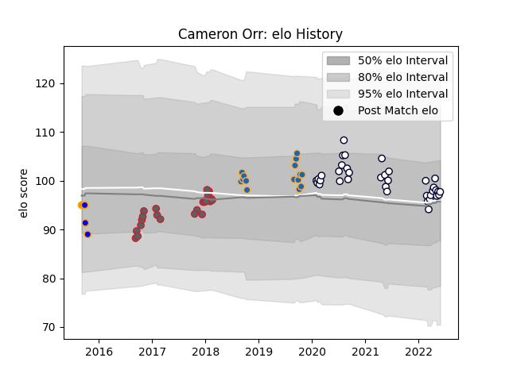

---  
layout: page  
title: Cameron Orr  
date: 2023-03-17 17:19:26.919073  
categories: player  
---
# Cameron Orr

## Positions: P

## Current elo: 99.0

## Current Percentile: 61.0

# Elo History

# Match History

| Team                |   Appearances |   Win Rate |
|:--------------------|--------------:|-----------:|
| Melbourne Rebels    |            38 |   0.355263 |
| Gloucester Rugby    |            23 |   0.565217 |
| Western Force       |            15 |   0.8      |
| Greater Sydney Rams |             6 |   0.166667 |

| Opponent                 |   Matches |   Win Rate |
|:-------------------------|----------:|-----------:|
| New South Wales Waratahs |         6 |   0.666667 |
| Brumbies                 |         5 |   0.2      |
| Queensland Reds          |         5 |   0.1      |
| Western Force            |         4 |   0.75     |
| Brisbane City            |         4 |   0.75     |
| Canberra Vikings         |         4 |   0.5      |
| Fijian Drua              |         4 |   0.5      |
| Melbourne Rising         |         3 |   0.666667 |
| Hurricanes               |         3 |   0        |
| Queensland Country       |         3 |   0.666667 |
| Highlanders              |         3 |   0.666667 |
| Newcastle Falcons        |         2 |   0        |
| Northampton Saints       |         2 |   0        |
| Agen                     |         2 |   1        |
| Wasps                    |         2 |   0        |
| Worcester Warriors       |         2 |   0.25     |
| Sale Sharks              |         2 |   1        |
| NSW Country Eagles       |         2 |   0.5      |
| Chiefs                   |         2 |   0        |
| Leicester Tigers         |         2 |   0.5      |
| Blues                    |         2 |   0        |
| Crusaders                |         2 |   0        |
| Zebre                    |         2 |   1        |
| Ospreys                  |         1 |   1        |
| Pau                      |         1 |   0        |
| Dragons                  |         1 |   1        |
| North Harbour Rays       |         1 |   1        |
| Moana Pasifika           |         1 |   1        |
| Saracens                 |         1 |   1        |
| Sharks                   |         1 |   0        |
| Sunwolves                |         1 |   0        |
| Sydney Rays              |         1 |   1        |
| Sydney Stars             |         1 |   0        |
| Lions                    |         1 |   1        |
| Benetton Treviso         |         1 |   1        |
| Bayonne                  |         1 |   1        |
| Bath Rugby               |         1 |   0.5      |