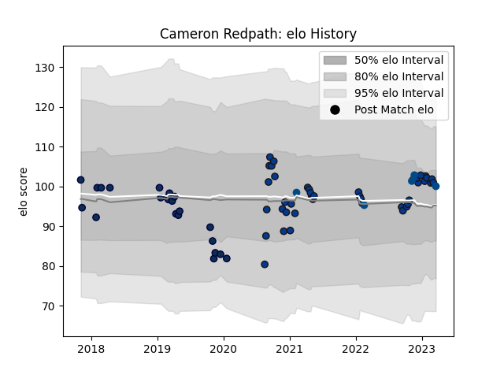

---  
layout: page  
title: Cameron Redpath  
date: 2022-11-22 11:32:49.679200  
categories: player  
---
# Cameron Redpath

## Positions: C

## Country: Scotland

## Current elo: 107.0

## Current Percentile: 79.0

# Elo History

# Match History

| Team        |   Appearances |   Win Rate |
|:------------|--------------:|-----------:|
| Bath Rugby  |            27 |   0.462963 |
| Sale Sharks |            24 |   0.4375   |
| Scotland    |             4 |   0.75     |

| Opponent           |   Matches |   Win Rate |
|:-------------------|----------:|-----------:|
| Leicester Tigers   |         5 |   0.8      |
| Bristol Rugby      |         5 |   0.1      |
| Exeter Chiefs      |         4 |   0        |
| Wasps              |         4 |   0.5      |
| Saracens           |         4 |   0.375    |
| Worcester Warriors |         4 |   0.75     |
| Gloucester Rugby   |         3 |   0.333333 |
| Harlequins         |         3 |   1        |
| Newcastle Falcons  |         3 |   0        |
| Northampton Saints |         3 |   0.666667 |
| Sale Sharks        |         3 |   0.333333 |
| Glasgow Warriors   |         2 |   0        |
| Bath Rugby         |         2 |   0.5      |
| Connacht           |         2 |   0.5      |
| Fiji               |         1 |   1        |
| La Rochelle        |         1 |   0        |
| London Irish       |         1 |   1        |
| Perpignan          |         1 |   1        |
| England            |         1 |   1        |
| Scarlets           |         1 |   1        |
| Wales              |         1 |   0        |
| Argentina          |         1 |   1        |