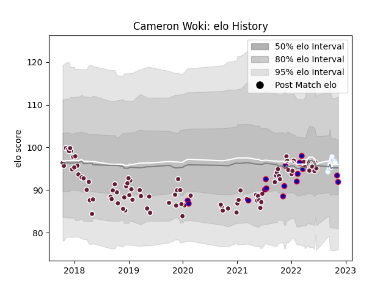

---  
layout: page  
title: Cameron Woki  
date: 2022-11-15 23:36:01.503802  
categories: player  
---
# Cameron Woki

## Positions: FL, L

## Country: France

## Current elo: 92.0

## Current Percentile: 41.0

# Elo History

# Match History

| Team            |   Appearances |   Win Rate |
|:----------------|--------------:|-----------:|
| Bordeaux Begles |            87 |   0.586207 |
| France          |            16 |   0.8125   |
| Racing 92       |             7 |   0.428571 |

| Opponent             |   Matches |   Win Rate |
|:---------------------|----------:|-----------:|
| Stade Toulousain     |         8 |   0.125    |
| Agen                 |         7 |   0.857143 |
| Racing 92            |         7 |   0.714286 |
| La Rochelle          |         7 |   0.428571 |
| Pau                  |         6 |   0.666667 |
| Montpellier Herault  |         6 |   0.666667 |
| Lyon                 |         6 |   0.833333 |
| Toulon               |         5 |   0.4      |
| Brive                |         5 |   0.7      |
| Castres Olympique    |         5 |   0.7      |
| Stade Francais Paris |         5 |   0.6      |
| Australia            |         4 |   0.5      |
| Perpignan            |         4 |   0.625    |
| England              |         3 |   0.666667 |
| Edinburgh            |         3 |   0.833333 |
| Clermont Auvergne    |         3 |   0.666667 |
| Italy                |         2 |   1        |
| Connacht             |         2 |   0        |
| Sale Sharks          |         2 |   0.5      |
| Newcastle Falcons    |         2 |   0        |
| Bayonne              |         2 |   0.5      |
| RC Enisei            |         2 |   1        |
| South Africa         |         1 |   1        |
| Scotland             |         1 |   1        |
| Scarlets             |         1 |   1        |
| Wales                |         1 |   1        |
| Leicester Tigers     |         1 |   0        |
| New Zealand          |         1 |   1        |
| Argentina            |         1 |   1        |
| Ireland              |         1 |   1        |
| Georgia              |         1 |   1        |
| Dragons              |         1 |   0        |
| Bristol Rugby        |         1 |   0        |
| Bordeaux Begles      |         1 |   0        |
| Biarritz Olympique   |         1 |   1        |
| Wasps                |         1 |   1        |