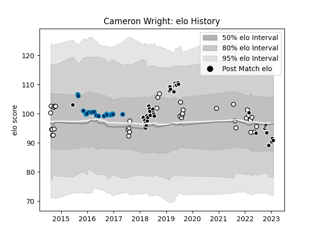

---  
layout: page  
title: Cameron Wright  
date: 2023-01-13 11:23:09.153827  
categories: player  
---
# Cameron Wright

## Positions: SH

## Current elo: 90.0

## Current Percentile: 30.0

# Elo History

# Match History

| Team                |   Appearances |   Win Rate |
|:--------------------|--------------:|-----------:|
| Natal Sharks        |            36 |   0.652778 |
| Sharks              |            36 |   0.472222 |
| Montpellier Herault |            23 |   0.565217 |

| Opponent                 |   Matches |   Win Rate |
|:-------------------------|----------:|-----------:|
| Free State Cheetahs      |         8 |   0.5625   |
| Pumas                    |         6 |   0.666667 |
| Griquas                  |         6 |   0.666667 |
| Western Province         |         5 |   0.4      |
| Blue Bulls               |         5 |   0.8      |
| Golden Lions             |         5 |   0.8      |
| Stormers                 |         5 |   0.6      |
| Bulls                    |         4 |   0        |
| Lions                    |         3 |   0.666667 |
| Toulon                   |         3 |   0.333333 |
| Cardiff Blues            |         3 |   0.333333 |
| New South Wales Waratahs |         2 |   0.75     |
| Jaguares                 |         2 |   0.5      |
| Stade Francais Paris     |         2 |   0.5      |
| Stade Toulousain         |         2 |   0.5      |
| Crusaders                |         2 |   0.25     |
| Sunwolves                |         2 |   1        |
| Chiefs                   |         2 |   0.5      |
| Castres Olympique        |         2 |   0.5      |
| Brumbies                 |         2 |   0        |
| Brive                    |         2 |   1        |
| Blues                    |         2 |   1        |
| Sale Sharks              |         1 |   1        |
| Racing 92                |         1 |   0        |
| Queensland Reds          |         1 |   0        |
| Pau                      |         1 |   0        |
| Oyonnax                  |         1 |   1        |
| Northampton Saints       |         1 |   0        |
| Agen                     |         1 |   1        |
| Melbourne Rebels         |         1 |   0        |
| Lyon                     |         1 |   1        |
| Leinster                 |         1 |   0        |
| La Rochelle              |         1 |   0        |
| Benetton Treviso         |         1 |   1        |
| Highlanders              |         1 |   1        |
| Grenoble                 |         1 |   1        |
| Glasgow Warriors         |         1 |   1        |
| Eastern Province Kings   |         1 |   1        |
| Dragons                  |         1 |   1        |
| Connacht                 |         1 |   0        |
| Calvisano                |         1 |   1        |
| Hurricanes               |         1 |   0        |