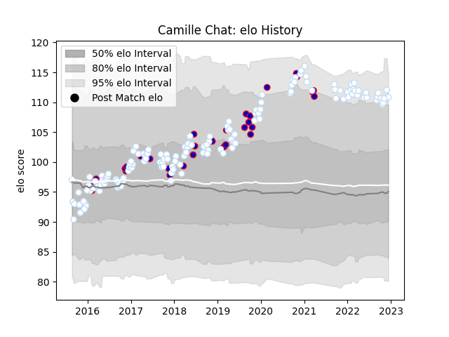

---  
layout: page  
title: Camille Chat  
date: 2023-01-06 00:17:40.971614  
categories: player  
---
# Camille Chat

## Positions: H

## Country: France

## Current elo: 122.0

## Current Percentile: 93.0

# Elo History

# Match History

| Team      |   Appearances |   Win Rate |
|:----------|--------------:|-----------:|
| Racing 92 |           147 |   0.642857 |
| France    |            34 |   0.485294 |

| Opponent                 |   Matches |   Win Rate |
|:-------------------------|----------:|-----------:|
| Clermont Auvergne        |        15 |   0.7      |
| Stade Toulousain         |        11 |   0.636364 |
| Toulon                   |        10 |   0.6      |
| Stade Francais Paris     |        10 |   0.6      |
| Bordeaux Begles          |        10 |   0.6      |
| Lyon                     |         9 |   0.555556 |
| Montpellier Herault      |         8 |   0.75     |
| Castres Olympique        |         8 |   0.5625   |
| La Rochelle              |         7 |   0.571429 |
| Pau                      |         7 |   0.785714 |
| Munster                  |         7 |   0.5      |
| Wales                    |         7 |   0.571429 |
| Brive                    |         7 |   0.857143 |
| New Zealand              |         5 |   0        |
| Scotland                 |         5 |   0.4      |
| Agen                     |         5 |   0.6      |
| Glasgow Warriors         |         4 |   0.25     |
| Bayonne                  |         4 |   0.75     |
| Leicester Tigers         |         4 |   0.75     |
| Ireland                  |         3 |   0.666667 |
| Italy                    |         3 |   1        |
| Scarlets                 |         3 |   1        |
| Perpignan                |         3 |   0.666667 |
| Grenoble                 |         3 |   0.666667 |
| Oyonnax                  |         2 |   1        |
| Northampton Saints       |         2 |   0.75     |
| England                  |         2 |   0        |
| Saracens                 |         2 |   1        |
| Argentina                |         2 |   1        |
| South Africa             |         2 |   0        |
| Leinster                 |         2 |   0        |
| Ospreys                  |         1 |   1        |
| Japan                    |         1 |   0.5      |
| Exeter Chiefs            |         1 |   0        |
| Biarritz Olympique       |         1 |   0        |
| Tonga                    |         1 |   1        |
| Australia                |         1 |   0        |
| Ulster                   |         1 |   1        |
| United States of America |         1 |   1        |
| Samoa                    |         1 |   1        |