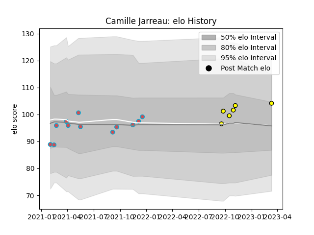

---  
layout: page  
title: Camille Jarreau  
date: 2023-03-12 11:32:58.575486  
categories: player  
---
# Camille Jarreau

## Positions: N8

## Current elo: 104.0

## Current Percentile: 73.0

# Elo History

# Match History

| Team             |   Appearances |   Win Rate |
|:-----------------|--------------:|-----------:|
| Bourgoin-Jallieu |            12 |  0.0833333 |
| Albi             |             6 |  0.833333  |

| Opponent                   |   Matches |   Win Rate |
|:---------------------------|----------:|-----------:|
| Dax                        |         3 |   0.666667 |
| Narbonne                   |         2 |   0.5      |
| Aubenas                    |         1 |   0        |
| Blagnac                    |         1 |   0        |
| Bourgoin-Jallieu           |         1 |   1        |
| Carqueiranne-Hyères        |         1 |   0        |
| Chambery                   |         1 |   1        |
| Dijon                      |         1 |   0        |
| Massy                      |         1 |   0        |
| Nice                       |         1 |   0        |
| Soyaux-Angouleme           |         1 |   0        |
| Suresnes                   |         1 |   0        |
| Tarbes                     |         1 |   0        |
| US Bressane                |         1 |   0        |
| Valence Romans Drome Rugby |         1 |   1        |