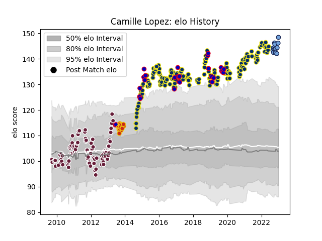

---  
layout: page  
title: Camille Lopez  
date: 2022-12-12 15:29:00.308415  
categories: player  
---
# Camille Lopez

## Positions: FH

## Country: France

## Current elo: 130.0

## Current Percentile: 97.0

# Elo History

# Match History

| Team              |   Appearances |   Win Rate |
|:------------------|--------------:|-----------:|
| Clermont Auvergne |           166 |   0.680723 |
| Bordeaux Begles   |            71 |   0.443662 |
| France            |            27 |   0.481481 |
| Perpignan         |            13 |   0.461538 |
| Bayonne           |            12 |   0.583333 |

| Opponent                 |   Matches |   Win Rate |
|:-------------------------|----------:|-----------:|
| Racing 92                |        20 |   0.425    |
| Stade Toulousain         |        18 |   0.583333 |
| Stade Francais Paris     |        17 |   0.558824 |
| Montpellier Herault      |        15 |   0.4      |
| Bordeaux Begles          |        15 |   0.533333 |
| Castres Olympique        |        15 |   0.6      |
| La Rochelle              |        15 |   0.633333 |
| Toulon                   |        15 |   0.466667 |
| Agen                     |        12 |   0.833333 |
| Pau                      |        11 |   0.818182 |
| Grenoble                 |        11 |   0.681818 |
| Brive                    |         9 |   0.777778 |
| Bayonne                  |         8 |   0.5      |
| Lyon                     |         8 |   0.625    |
| Biarritz Olympique       |         6 |   0.666667 |
| Clermont Auvergne        |         5 |   0.2      |
| Perpignan                |         5 |   0.8      |
| Mont-de-Marsan           |         4 |   0.75     |
| Scotland                 |         4 |   0.75     |
| Exeter Chiefs            |         4 |   0.75     |
| Northampton Saints       |         4 |   1        |
| Saracens                 |         4 |   0.5      |
| Ulster                   |         4 |   0.5      |
| Wales                    |         4 |   0.25     |
| Oyonnax                  |         4 |   0.5      |
| Munster                  |         3 |   0.666667 |
| Argentina                |         3 |   0.666667 |
| Ospreys                  |         3 |   0.666667 |
| Italy                    |         3 |   1        |
| Harlequins               |         3 |   1        |
| Gloucester Rugby         |         3 |   0        |
| Sale Sharks              |         2 |   1        |
| Saint-Etienne            |         2 |   1        |
| Wasps                    |         2 |   0        |
| New Zealand              |         2 |   0        |
| Ireland                  |         2 |   0        |
| Fiji                     |         2 |   0.5      |
| England                  |         2 |   0        |
| Dax                      |         2 |   1        |
| Australia                |         2 |   0.5      |
| Narbonne                 |         2 |   0.5      |
| Bath Rugby               |         2 |   1        |
| Tarbes                   |         1 |   0        |
| Auch                     |         1 |   1        |
| United States of America |         1 |   1        |
| Aurillac                 |         1 |   0        |
| Tonga                    |         1 |   1        |
| South Africa             |         1 |   0        |
| Carcassonne              |         1 |   1        |
| Colomiers                |         1 |   1        |
| Dragons                  |         1 |   1        |
| Lannemezan               |         1 |   1        |
| Leinster                 |         1 |   1        |
| London Irish             |         1 |   0        |