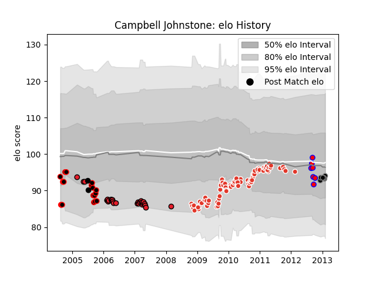

---  
layout: page  
title: Campbell Johnstone  
date: 2023-03-21 18:21:09.963220  
categories: player  
---
# Campbell Johnstone

Last updated: 2023-03-21
## Positions: P

## Country: New Zealand

## Current elo: 94.0

## Current Percentile: 41.0

# Elo History

# Match History

| Team               |   Appearances |   Win Rate |
|:-------------------|--------------:|-----------:|
| Biarritz Olympique |            80 |   0.56875  |
| Crusaders          |            26 |   0.673077 |
| Canterbury         |            19 |   0.736842 |
| Ospreys            |             7 |   0.357143 |
| Tasman             |             7 |   0.571429 |
| New Zealand        |             2 |   1        |

| Opponent                 |   Matches |   Win Rate |
|:-------------------------|----------:|-----------:|
| Stade Toulousain         |        10 |   0.4      |
| Bayonne                  |         6 |   0.666667 |
| Clermont Auvergne        |         6 |   0.333333 |
| Brive                    |         6 |   0.666667 |
| Toulon                   |         6 |   0.333333 |
| Castres Olympique        |         5 |   0.3      |
| Perpignan                |         5 |   0.4      |
| Stade Francais Paris     |         5 |   0.6      |
| Racing 92                |         4 |   0.25     |
| Otago                    |         4 |   0.25     |
| New South Wales Waratahs |         3 |   1        |
| Montauban                |         3 |   0.666667 |
| Hurricanes               |         3 |   1        |
| Southland                |         3 |   1        |
| Dragons                  |         3 |   0.666667 |
| Stormers                 |         3 |   0.666667 |
| Northland                |         3 |   0.666667 |
| Taranaki                 |         3 |   0.333333 |
| Bourgoin-Jallieu         |         3 |   0.666667 |
| Wellington               |         3 |   0.666667 |
| Sharks                   |         2 |   0.5      |
| North Harbour            |         2 |   0.5      |
| Albi                     |         2 |   0.5      |
| Western Force            |         2 |   0.75     |
| Montpellier Herault      |         2 |   0.5      |
| Mont-de-Marsan           |         2 |   1        |
| Queensland Reds          |         2 |   1        |
| Bay of Plenty            |         2 |   1        |
| Aironi                   |         2 |   0.5      |
| Bulls                    |         2 |   0.5      |
| Waikato                  |         2 |   1        |
| Highlanders              |         2 |   1        |
| Blues                    |         2 |   0.5      |
| Gloucester Rugby         |         2 |   1        |
| Glasgow Warriors         |         2 |   1        |
| British and Irish Lions  |         2 |   1        |
| Brumbies                 |         2 |   0        |
| La Rochelle              |         2 |   1        |
| Ulster                   |         1 |   1        |
| Agen                     |         1 |   0        |
| Ospreys                  |         1 |   1        |
| Munster                  |         1 |   1        |
| Manawatu                 |         1 |   1        |
| Lions                    |         1 |   0        |
| Leicester Tigers         |         1 |   0.5      |
| Harlequins               |         1 |   0        |
| Counties Manukau         |         1 |   1        |
| Chiefs                   |         1 |   0        |
| Cheetahs                 |         1 |   1        |
| Canterbury               |         1 |   1        |
| Calvisano                |         1 |   1        |
| Bordeaux Begles          |         1 |   1        |
| Benetton Treviso         |         1 |   0        |
| Bath Rugby               |         1 |   1        |
| Auckland                 |         1 |   1        |
| Zebre                    |         1 |   1        |