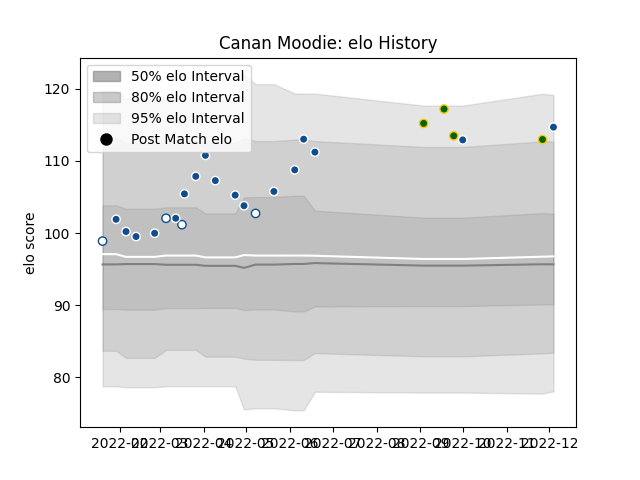

---  
layout: page  
title: Canan Moodie  
date: 2022-12-09 13:15:31.141636  
categories: player  
---
# Canan Moodie

## Positions: W, FB

## Country: South Africa

## Current elo: 115.0

## Current Percentile: 90.0

# Elo History

# Match History

| Team         |   Appearances |   Win Rate |
|:-------------|--------------:|-----------:|
| Bulls        |            17 |   0.823529 |
| Blue Bulls   |             4 |   1        |
| South Africa |             4 |   1        |

| Opponent         |   Matches |   Win Rate |
|:-----------------|----------:|-----------:|
| Argentina        |         2 |        1   |
| Griquas          |         2 |        1   |
| Stormers         |         2 |        0   |
| Sharks           |         2 |        0.5 |
| Lions            |         2 |        1   |
| Dragons          |         1 |        1   |
| England          |         1 |        1   |
| Glasgow Warriors |         1 |        1   |
| Connacht         |         1 |        1   |
| Leinster         |         1 |        1   |
| Australia        |         1 |        1   |
| Munster          |         1 |        1   |
| Natal Sharks     |         1 |        1   |
| Ospreys          |         1 |        1   |
| Scarlets         |         1 |        1   |
| Cardiff Blues    |         1 |        1   |
| Benetton Treviso |         1 |        1   |
| Ulster           |         1 |        1   |
| Western Province |         1 |        1   |
| Zebre            |         1 |        1   |