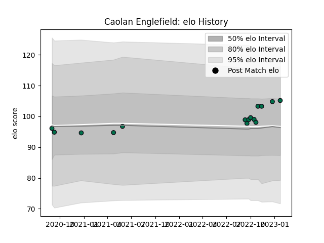

---  
layout: page  
title: Caolan Englefield  
date: 2022-11-16 11:24:31.557485  
categories: player  
---
# Caolan Englefield

## Positions: SH

## Current elo: 98.0

## Current Percentile: 56.0

# Elo History

# Match History

| Team         |   Appearances |   Win Rate |
|:-------------|--------------:|-----------:|
| London Irish |            12 |   0.166667 |

| Opponent           |   Matches |   Win Rate |
|:-------------------|----------:|-----------:|
| Harlequins         |         3 |          0 |
| Gloucester Rugby   |         2 |          0 |
| Bath Rugby         |         1 |          1 |
| Bristol Rugby      |         1 |          0 |
| Exeter Chiefs      |         1 |          0 |
| Northampton Saints |         1 |          0 |
| Sale Sharks        |         1 |          0 |
| Saracens           |         1 |          0 |
| Worcester Warriors |         1 |          1 |