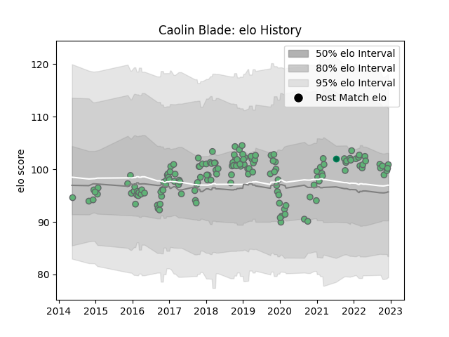

---  
layout: page  
title: Caolin Blade  
date: 2022-12-09 13:17:28.500854  
categories: player  
---
# Caolin Blade

## Positions: SH

## Country: Ireland

## Current elo: 100.0

## Current Percentile: 67.0

# Elo History

# Match History

| Team     |   Appearances |   Win Rate |
|:---------|--------------:|-----------:|
| Connacht |           147 |   0.513605 |
| Ireland  |             1 |   1        |

| Opponent                 |   Matches |   Win Rate |
|:-------------------------|----------:|-----------:|
| Leinster                 |        14 |  0.214286  |
| Ospreys                  |        12 |  0.5       |
| Ulster                   |        11 |  0.363636  |
| Munster                  |        11 |  0.0909091 |
| Benetton Treviso         |        10 |  0.9       |
| Edinburgh                |         9 |  0.444444  |
| Zebre                    |         7 |  0.714286  |
| Scarlets                 |         7 |  0.428571  |
| Cardiff Blues            |         7 |  0.714286  |
| Dragons                  |         7 |  0.571429  |
| Glasgow Warriors         |         5 |  0.2       |
| Cheetahs                 |         5 |  0.8       |
| Southern Kings           |         4 |  1         |
| Gloucester Rugby         |         3 |  0.333333  |
| Stade Toulousain         |         3 |  0.333333  |
| Sale Sharks              |         3 |  0.333333  |
| RC Enisei                |         2 |  1         |
| Stade Francais Paris     |         2 |  0.5       |
| Stormers                 |         2 |  0.5       |
| Wasps                    |         2 |  0.5       |
| Worcester Warriors       |         2 |  0.75      |
| Bayonne                  |         2 |  1         |
| Perpignan                |         2 |  1         |
| Oyonnax                  |         2 |  1         |
| Montpellier Herault      |         2 |  0.5       |
| Exeter Chiefs            |         2 |  0         |
| Bordeaux Begles          |         2 |  1         |
| Newcastle Falcons        |         2 |  0.5       |
| Sharks                   |         1 |  0         |
| Lions                    |         1 |  1         |
| La Rochelle              |         1 |  1         |
| Bulls                    |         1 |  1         |
| United States of America |         1 |  1         |
| Brive                    |         1 |  0         |