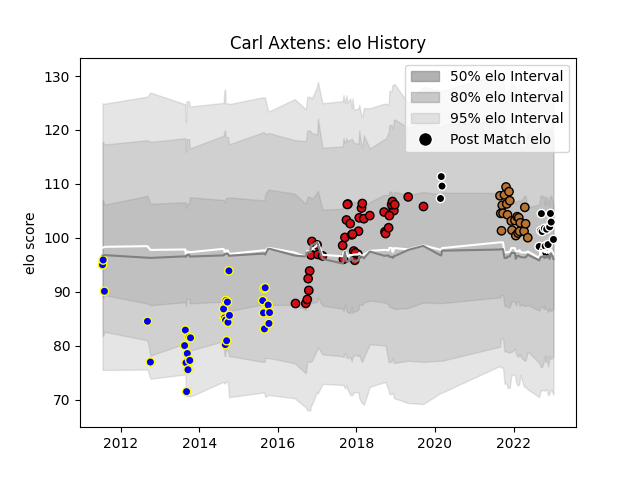

---  
layout: page  
title: Carl Axtens  
date: 2023-01-13 11:38:41.841057  
categories: player  
---
# Carl Axtens

## Positions: N8, FL

## Current elo: 100.0

## Current Percentile: 63.0

# Elo History

# Match History

| Team             |   Appearances |   Win Rate |
|:-----------------|--------------:|-----------:|
| Stade Toulousain |            43 |   0.627907 |
| Bay of Plenty    |            32 |   0.25     |
| Narbonne         |            24 |   0.229167 |
| Provence Rugby   |            17 |   0.588235 |

| Opponent             |   Matches |   Win Rate |
|:---------------------|----------:|-----------:|
| Grenoble             |         6 |   0.666667 |
| Agen                 |         5 |   0.6      |
| Lyon                 |         5 |   0.4      |
| Clermont Auvergne    |         5 |   0.5      |
| Oyonnax              |         5 |   0.4      |
| Colomiers            |         4 |   0        |
| Counties Manukau     |         4 |   0.5      |
| Stade Francais Paris |         3 |   1        |
| Southland            |         3 |   0.333333 |
| Rouen                |         3 |   0.666667 |
| Pau                  |         3 |   1        |
| Tasman               |         3 |   0        |
| Otago                |         3 |   0.333333 |
| Waikato              |         3 |   0        |
| Northland            |         3 |   0        |
| Wasps                |         3 |   0.833333 |
| North Harbour        |         3 |   1        |
| Mont-de-Marsan       |         3 |   0.333333 |
| Montpellier Herault  |         3 |   0        |
| Hawke's Bay          |         3 |   0.333333 |
| Castres Olympique    |         3 |   0.666667 |
| Carcassonne          |         3 |   0.333333 |
| Racing 92            |         2 |   0.5      |
| Provence Rugby       |         2 |   1        |
| Aurillac             |         2 |   0.5      |
| Bayonne              |         2 |   0        |
| Vannes               |         2 |   0        |
| US Bressane          |         2 |   0.5      |
| Beziers              |         2 |   0.5      |
| Bordeaux Begles      |         2 |   1        |
| Sale Sharks          |         2 |   0.75     |
| Wellington           |         2 |   0        |
| Auckland             |         2 |   0        |
| Montauban            |         2 |   0.5      |
| La Rochelle          |         2 |   0        |
| Massy                |         1 |   0        |
| Canterbury           |         1 |   0        |
| Roval Drome XV       |         1 |   1        |
| Perpignan            |         1 |   1        |
| Brive                |         1 |   1        |
| Soyaux-Angouleme     |         1 |   1        |
| Cardiff Blues        |         1 |   0        |
| Taranaki             |         1 |   0        |
| Connacht             |         1 |   0        |
| Nevers               |         1 |   0        |
| Manawatu             |         1 |   0        |