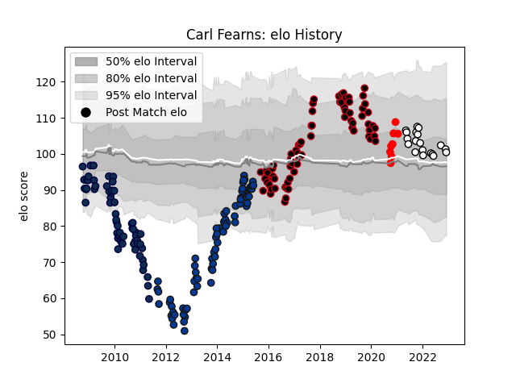

---  
layout: page  
title: Carl Fearns  
date: 2023-01-06 00:08:50.656169  
categories: player  
---
# Carl Fearns

## Positions: N8, FL

## Current elo: 118.0

## Current Percentile: 80.0

# Elo History

# Match History

| Team              |   Appearances |   Win Rate |
|:------------------|--------------:|-----------:|
| Lyon              |            81 |   0.691358 |
| Bath Rugby        |            74 |   0.648649 |
| Sale Sharks       |            62 |   0.33871  |
| Newcastle Falcons |            22 |   0.431818 |
| Rouen             |             9 |   0.333333 |

| Opponent                   |   Matches |   Win Rate |
|:---------------------------|----------:|-----------:|
| Leicester Tigers           |        15 |   0.3      |
| Harlequins                 |        15 |   0.466667 |
| Northampton Saints         |        15 |   0.1      |
| Exeter Chiefs              |        12 |   0.666667 |
| Gloucester Rugby           |        11 |   0.636364 |
| London Irish               |        10 |   0.5      |
| Wasps                      |        10 |   0.8      |
| Saracens                   |         9 |   0.111111 |
| Sale Sharks                |         9 |   0.444444 |
| Worcester Warriors         |         8 |   0.8125   |
| Bath Rugby                 |         8 |   0.125    |
| Newcastle Falcons          |         7 |   0.571429 |
| Stade Francais Paris       |         6 |   0.833333 |
| Bordeaux Begles            |         6 |   0.666667 |
| Toulon                     |         6 |   0.666667 |
| Pau                        |         6 |   0.666667 |
| Brive                      |         5 |   0.7      |
| Montpellier Herault        |         5 |   0.6      |
| Stade Toulousain           |         5 |   0.6      |
| Castres Olympique          |         5 |   0.4      |
| Cardiff Blues              |         5 |   0.2      |
| Dragons                    |         4 |   0.5      |
| Bayonne                    |         4 |   0.875    |
| Racing 92                  |         4 |   0.75     |
| Montauban                  |         4 |   1        |
| Yorkshire Carnegie         |         4 |   0.75     |
| Perpignan                  |         3 |   0.666667 |
| Mont-de-Marsan             |         3 |   0.666667 |
| Agen                       |         3 |   0.666667 |
| Leeds                      |         3 |   0.666667 |
| Grenoble                   |         3 |   1        |
| Clermont Auvergne          |         3 |   0.666667 |
| Glasgow Warriors           |         3 |   0.333333 |
| London Welsh               |         3 |   1        |
| Mogliano                   |         2 |   1        |
| Provence Rugby             |         2 |   1        |
| Valence Romans Drome Rugby |         2 |   0.5      |
| Biarritz Olympique         |         2 |   0.5      |
| Carcassonne                |         2 |   0.5      |
| Colomiers                  |         2 |   0.5      |
| Dax                        |         2 |   1        |
| Leinster                   |         2 |   0        |
| Ospreys                    |         1 |   0        |
| La Rochelle                |         1 |   1        |
| Soyaux-Angouleme           |         1 |   1        |
| Bristol Rugby              |         1 |   1        |
| Narbonne                   |         1 |   1        |
| Beziers                    |         1 |   1        |
| Albi                       |         1 |   1        |
| Vannes                     |         1 |   0        |
| Benetton Treviso           |         1 |   1        |
| Aurillac                   |         1 |   1        |