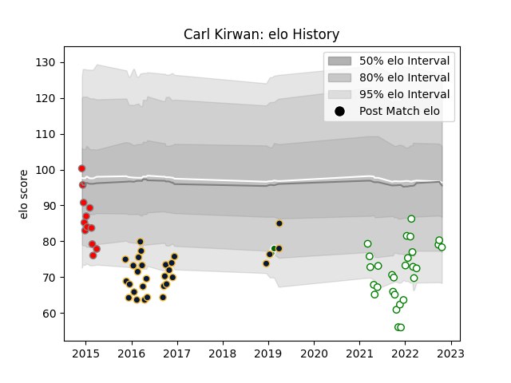

---  
layout: page  
title: Carl Kirwan  
date: 2023-03-21 18:13:37.772690  
categories: player  
---
# Carl Kirwan

Last updated: 2023-03-21
## Positions: FL

## Current elo: 78.0

## Current Percentile: 12.0

# Elo History

# Match History

| Team                |   Appearances |   Win Rate |
|:--------------------|--------------:|-----------:|
| Worcester Warriors  |            29 |   0.37931  |
| Nottingham          |            28 |   0.321429 |
| London Welsh        |            12 |   0        |
| Ealing Trailfinders |             2 |   1        |

| Opponent            |   Matches |   Win Rate |
|:--------------------|----------:|-----------:|
| Gloucester Rugby    |         5 |   0.3      |
| Saracens            |         4 |   0        |
| Harlequins          |         4 |   0.25     |
| Ampthill            |         3 |   0.333333 |
| Ealing Trailfinders |         3 |   0        |
| Bath Rugby          |         3 |   0        |
| Northampton Saints  |         3 |   0        |
| Richmond            |         3 |   0.333333 |
| Doncaster           |         3 |   0.333333 |
| Coventry            |         3 |   0.333333 |
| Cornish Pirates     |         3 |   0.333333 |
| Sale Sharks         |         3 |   0.5      |
| Bedford             |         3 |   0.333333 |
| London Irish        |         3 |   0.333333 |
| Leicester Tigers    |         2 |   0        |
| Newcastle Falcons   |         2 |   0.5      |
| London Scottish     |         2 |   1        |
| Jersey              |         2 |   0        |
| La Rochelle         |         2 |   0.5      |
| Hartpury College    |         2 |   0.5      |
| Exeter Chiefs       |         2 |   0        |
| Edinburgh           |         2 |   0        |
| Zebre               |         2 |   0        |
| Ospreys             |         1 |   1        |
| Pau                 |         1 |   1        |
| Dragons             |         1 |   1        |
| Caldy               |         1 |   1        |
| Bristol Rugby       |         1 |   1        |
| Wasps               |         1 |   0        |
| Yorkshire Carnegie  |         1 |   1        |