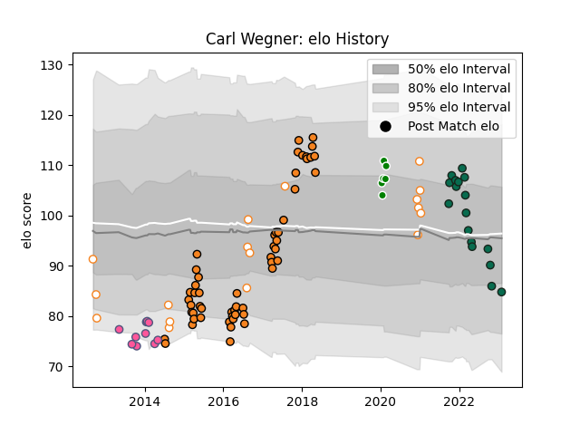

---  
layout: page  
title: Carl Wegner  
date: 2023-01-30 11:45:02.953946  
categories: player  
---
# Carl Wegner

## Positions: L

## Current elo: 85.0

## Current Percentile: 24.0

# Elo History

# Match History

| Team                 |   Appearances |   Win Rate |
|:---------------------|--------------:|-----------:|
| Cheetahs             |            54 |   0.314815 |
| Benetton Treviso     |            17 |   0.264706 |
| Free State Cheetahs  |            17 |   0.529412 |
| Stade Francais Paris |            10 |   0.5      |
| Toyota Verblitz      |             6 |   0.5      |

| Opponent                          |   Matches |   Win Rate |
|:----------------------------------|----------:|-----------:|
| Bulls                             |         6 |   0.166667 |
| Sharks                            |         6 |   0.333333 |
| Lions                             |         5 |   0        |
| Stormers                          |         5 |   0.4      |
| Natal Sharks                      |         4 |   0.5      |
| Western Province                  |         4 |   0.25     |
| Glasgow Warriors                  |         4 |   0.25     |
| Edinburgh                         |         4 |   0.5      |
| Sunwolves                         |         3 |   1        |
| Scarlets                          |         3 |   0.333333 |
| Munster                           |         3 |   0        |
| Jaguares                          |         2 |   0        |
| Lusitanos XV                      |         2 |   1        |
| Queensland Reds                   |         2 |   0        |
| New South Wales Waratahs          |         2 |   0        |
| Pumas                             |         2 |   0.5      |
| Highlanders                       |         2 |   0        |
| Southern Kings                    |         2 |   1        |
| Western Force                     |         2 |   1        |
| Leinster                          |         2 |   0        |
| Zebre                             |         2 |   1        |
| Cavalieri Prato                   |         2 |   1        |
| Blue Bulls                        |         2 |   0.5      |
| Blues                             |         2 |   0.5      |
| Griquas                           |         2 |   1        |
| Brumbies                          |         2 |   0        |
| Cardiff Blues                     |         2 |   0.5      |
| Dragons                           |         2 |   0.75     |
| Crusaders                         |         2 |   0        |
| Castres Olympique                 |         2 |   0.5      |
| Chiefs                            |         2 |   0        |
| Harlequins                        |         1 |   0        |
| Toulon                            |         1 |   0        |
| Tokyo Sungoliath                  |         1 |   0        |
| Boland Cavaliers                  |         1 |   1        |
| Shizuoka Blue Revs                |         1 |   0        |
| Clermont Auvergne                 |         1 |   0        |
| Saitama Wild Knights              |         1 |   0        |
| Hino Red Dolphins                 |         1 |   1        |
| Connacht                          |         1 |   0        |
| Mie Honda Heat                    |         1 |   1        |
| Melbourne Rebels                  |         1 |   0        |
| Eastern Province Kings            |         1 |   1        |
| Golden Lions                      |         1 |   0        |
| Kubota Spears Funabashi Tokyo-Bay |         1 |   1        |
| Biarritz Olympique                |         1 |   0        |
| Hurricanes                        |         1 |   0        |
| Benetton Treviso                  |         1 |   0        |