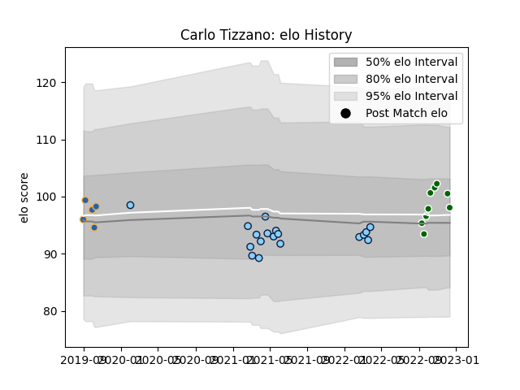

---  
layout: page  
title: Carlo Tizzano  
date: 2023-02-02 18:52:11.850426  
categories: player  
---
# Carlo Tizzano

## Positions: FL

## Current elo: 93.0

## Current Percentile: 44.0

# Elo History

# Match History

| Team                     |   Appearances |   Win Rate |
|:-------------------------|--------------:|-----------:|
| New South Wales Waratahs |            18 |   0.166667 |
| Ealing Trailfinders      |            13 |   0.923077 |
| Western Force            |             5 |   0.8      |

| Opponent           |   Matches |   Win Rate |
|:-------------------|----------:|-----------:|
| Western Force      |         3 |   0.333333 |
| Queensland Reds    |         3 |   0        |
| Melbourne Rebels   |         3 |   0.333333 |
| Brumbies           |         3 |   0        |
| Crusaders          |         2 |   0        |
| Hartpury College   |         2 |   1        |
| Fijian Drua        |         2 |   1        |
| Ampthill           |         2 |   1        |
| Coventry           |         2 |   0.5      |
| Doncaster          |         1 |   1        |
| Cornish Pirates    |         1 |   1        |
| Bedford            |         1 |   1        |
| Hurricanes         |         1 |   0        |
| Jersey             |         1 |   1        |
| London Scottish    |         1 |   1        |
| Brisbane City      |         1 |   1        |
| NSW Country Eagles |         1 |   0        |
| Nottingham         |         1 |   1        |
| Queensland Country |         1 |   1        |
| Blues              |         1 |   0        |
| Richmond           |         1 |   1        |
| Sydney Rays        |         1 |   1        |
| Highlanders        |         1 |   0        |