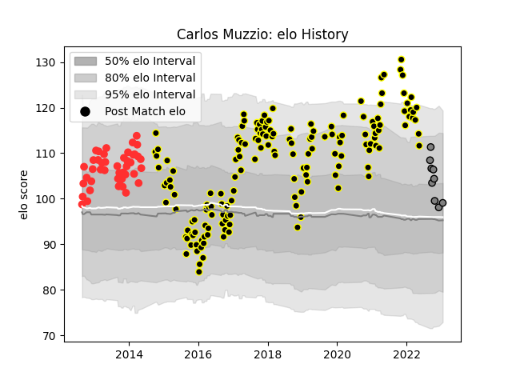

---  
layout: page  
title: Carlos Muzzio  
date: 2022-12-09 13:21:11.248136  
categories: player  
---
# Carlos Muzzio

## Positions: P

## Current elo: 97.0

## Current Percentile: 55.0

# Elo History

# Match History

| Team           |   Appearances |   Win Rate |
|:---------------|--------------:|-----------:|
| Mont-de-Marsan |           110 |   0.613636 |
| Tarbes         |            24 |   0.583333 |
| Rennes         |             8 |   0.125    |

| Opponent                   |   Matches |   Win Rate |
|:---------------------------|----------:|-----------:|
| Beziers                    |         9 |   0.666667 |
| Carcassonne                |         9 |   0.888889 |
| Montauban                  |         8 |   0.625    |
| Vannes                     |         7 |   0.428571 |
| Provence Rugby             |         7 |   0.714286 |
| Biarritz Olympique         |         7 |   0.571429 |
| Bourgoin-Jallieu           |         7 |   0.571429 |
| Aurillac                   |         6 |   0.833333 |
| Perpignan                  |         6 |   0.5      |
| Colomiers                  |         6 |   0.666667 |
| Albi                       |         5 |   0.8      |
| Narbonne                   |         5 |   0.8      |
| Nevers                     |         5 |   0.2      |
| Soyaux-Angouleme           |         5 |   0.8      |
| Tarbes                     |         5 |   0.4      |
| Dax                        |         4 |   0.5      |
| Grenoble                   |         4 |   0.25     |
| Lyon                       |         4 |   0.25     |
| Oyonnax                    |         4 |   0.5      |
| US Bressane                |         3 |   0.666667 |
| Rouen                      |         3 |   1        |
| Agen                       |         3 |   0.333333 |
| La Rochelle                |         3 |   0.666667 |
| Massy                      |         3 |   0.666667 |
| Mont-de-Marsan             |         2 |   0.5      |
| Pau                        |         2 |   0        |
| Brive                      |         2 |   0        |
| Valence Romans Drome Rugby |         2 |   0.25     |
| Nice                       |         1 |   0        |
| Cognac Saint Jean d'Angély |         1 |   1        |
| Chambery                   |         1 |   0        |
| Suresnes                   |         1 |   0        |
| Bayonne                    |         1 |   1        |
| Auch                       |         1 |   1        |