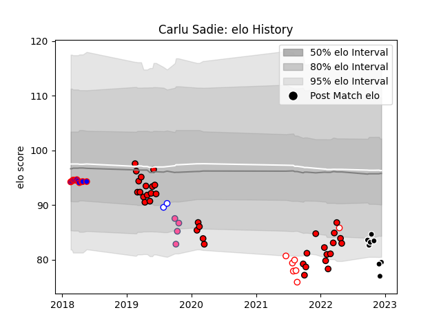

---  
layout: page  
title: Carlu Sadie  
date: 2023-01-06 00:21:10.453024  
categories: player  
---
# Carlu Sadie

## Positions: P

## Current elo: 105.0

## Current Percentile: 52.0

# Elo History

# Match History

| Team                 |   Appearances |   Win Rate |
|:---------------------|--------------:|-----------:|
| Lions                |            36 |   0.416667 |
| Golden Lions         |            11 |   0.318182 |
| Stormers             |            11 |   0.363636 |
| Sharks               |            10 |   0.7      |
| Stade Francais Paris |             6 |   0.333333 |
| Western Province     |             6 |   0.5      |

| Opponent                 |   Matches |   Win Rate |
|:-------------------------|----------:|-----------:|
| Bulls                    |         7 |   0.142857 |
| Stormers                 |         5 |   0.4      |
| Jaguares                 |         4 |   0.75     |
| Sharks                   |         4 |   0        |
| Griquas                  |         4 |   0.25     |
| Melbourne Rebels         |         3 |   0.666667 |
| Pumas                    |         3 |   0.333333 |
| Blue Bulls               |         3 |   0.333333 |
| Natal Sharks             |         3 |   0.333333 |
| Lions                    |         2 |   0.5      |
| Leinster                 |         2 |   0        |
| Highlanders              |         2 |   0.5      |
| New South Wales Waratahs |         2 |   0.5      |
| Golden Lions             |         2 |   0.5      |
| Glasgow Warriors         |         2 |   0.5      |
| Zebre                    |         2 |   1        |
| Queensland Reds          |         2 |   1        |
| Sunwolves                |         2 |   0.5      |
| Cardiff Blues            |         2 |   0.5      |
| Blues                    |         2 |   0.5      |
| Crusaders                |         2 |   0        |
| Ospreys                  |         1 |   1        |
| Munster                  |         1 |   1        |
| Scarlets                 |         1 |   0        |
| Toulon                   |         1 |   1        |
| Ulster                   |         1 |   0        |
| Western Province         |         1 |   1        |
| Agen                     |         1 |   0        |
| Hurricanes               |         1 |   0        |
| Bayonne                  |         1 |   1        |
| Free State Cheetahs      |         1 |   0.5      |
| Edinburgh                |         1 |   1        |
| Dragons                  |         1 |   1        |
| Connacht                 |         1 |   0        |
| Clermont Auvergne        |         1 |   0        |
| Chiefs                   |         1 |   1        |
| Castres Olympique        |         1 |   0        |
| Brumbies                 |         1 |   0        |
| Bordeaux Begles          |         1 |   0        |
| Benetton Treviso         |         1 |   1        |
| Harlequins               |         1 |   1        |