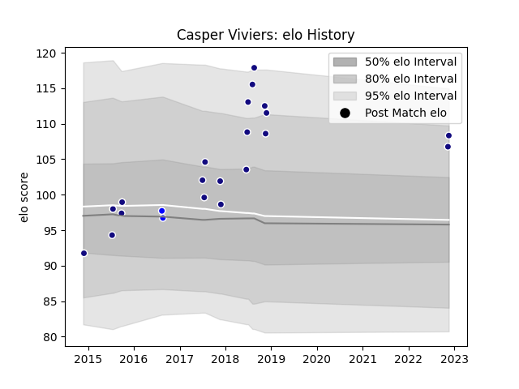

---  
layout: page  
title: Casper Viviers  
date: 2022-11-22 11:37:10.146097  
categories: player  
---
# Casper Viviers

## Positions: P

## Country: Namibia

## Current elo: 108.0

## Current Percentile: 85.0

# Elo History

# Match History

| Team                |   Appearances |   Win Rate |
|:--------------------|--------------:|-----------:|
| Namibia             |            20 |        0.6 |
| Namibia Welwitchias |             2 |        0   |

| Opponent    |   Matches |   Win Rate |
|:------------|----------:|-----------:|
| Russia      |         3 |   0.666667 |
| Portugal    |         2 |   0.5      |
| Spain       |         2 |   0        |
| Tunisia     |         2 |   1        |
| Uganda      |         2 |   1        |
| Uruguay     |         2 |   0        |
| Zimbabwe    |         2 |   1        |
| Canada      |         1 |   1        |
| Kenya       |         1 |   1        |
| Leopards    |         1 |   0        |
| Morocco     |         1 |   1        |
| New Zealand |         1 |   0        |
| SWD Eagles  |         1 |   0        |
| Tonga       |         1 |   0        |