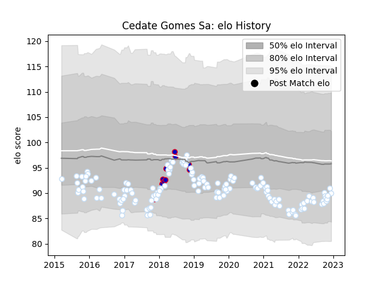

---  
layout: page  
title: Cedate Gomes Sa  
date: 2022-12-18 16:16:21.614599  
categories: player  
---
# Cedate Gomes Sa

## Positions: P

## Country: France

## Current elo: 90.0

## Current Percentile: 27.0

# Elo History

# Match History

| Team      |   Appearances |   Win Rate |
|:----------|--------------:|-----------:|
| Racing 92 |           143 |   0.559441 |
| France    |            10 |   0.3      |

| Opponent             |   Matches |   Win Rate |
|:---------------------|----------:|-----------:|
| Castres Olympique    |        15 |   0.6      |
| Stade Toulousain     |        14 |   0.357143 |
| La Rochelle          |        11 |   0.409091 |
| Bordeaux Begles      |        10 |   0.4      |
| Stade Francais Paris |        10 |   0.7      |
| Toulon               |         8 |   0.625    |
| Lyon                 |         8 |   0.5      |
| Montpellier Herault  |         7 |   0.571429 |
| Brive                |         7 |   0.571429 |
| Clermont Auvergne    |         7 |   0.642857 |
| Pau                  |         6 |   0.666667 |
| Munster              |         6 |   0.583333 |
| Leicester Tigers     |         4 |   1        |
| Agen                 |         4 |   0.5      |
| Bayonne              |         4 |   0.5      |
| Perpignan            |         3 |   0.666667 |
| New Zealand          |         3 |   0        |
| Glasgow Warriors     |         3 |   0        |
| Grenoble             |         2 |   1        |
| Northampton Saints   |         2 |   0.75     |
| Ospreys              |         2 |   1        |
| Biarritz Olympique   |         2 |   0.5      |
| Leinster             |         2 |   0        |
| Saracens             |         2 |   0.5      |
| Scarlets             |         2 |   1        |
| South Africa         |         1 |   0        |
| Ulster               |         1 |   1        |
| England              |         1 |   1        |
| Italy                |         1 |   1        |
| Scotland             |         1 |   0        |
| Oyonnax              |         1 |   1        |
| Argentina            |         1 |   1        |
| Ireland              |         1 |   0        |
| Wales                |         1 |   0        |