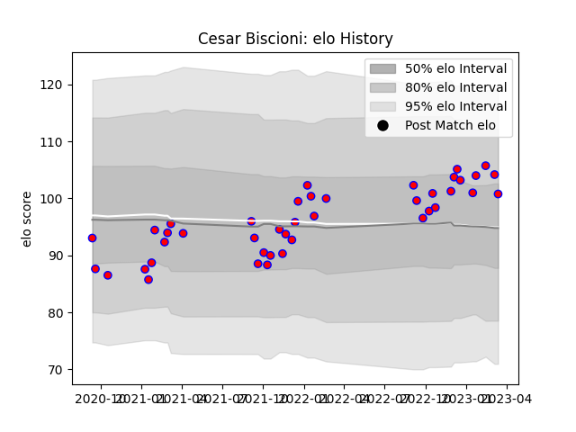

---  
layout: page  
title: Cesar Biscioni  
date: 2022-12-18 16:36:42.936519  
categories: player  
---
# Cesar Biscioni

## Positions: P

## Current elo: 90.0

## Current Percentile: 21.0

# Elo History

# Match History

| Team    |   Appearances |   Win Rate |
|:--------|--------------:|-----------:|
| Blagnac |            20 |       0.45 |

| Opponent                   |   Matches |   Win Rate |
|:---------------------------|----------:|-----------:|
| Chambery                   |         3 |   0.666667 |
| Cognac Saint Jean d'Angély |         3 |   0.666667 |
| Albi                       |         2 |   0.5      |
| Dax                        |         2 |   0        |
| US Bressane                |         2 |   0        |
| Aubenas                    |         1 |   0        |
| Bourgoin-Jallieu           |         1 |   1        |
| Dijon                      |         1 |   1        |
| Massy                      |         1 |   0        |
| Nice                       |         1 |   0        |
| Suresnes                   |         1 |   1        |
| Tarbes                     |         1 |   1        |
| Valence Romans Drome Rugby |         1 |   0        |