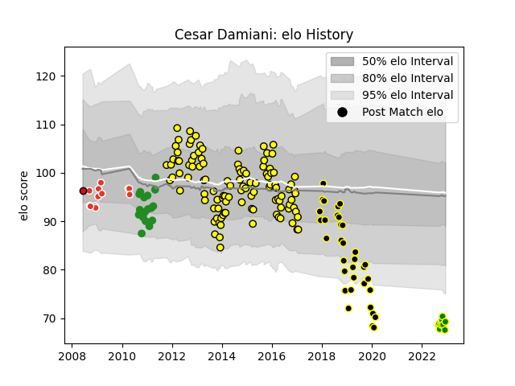

---  
layout: page  
title: Cesar Damiani  
date: 2023-01-15 11:55:48.232225  
categories: player  
---
# Cesar Damiani

## Positions: L

## Current elo: 89.0

## Current Percentile: 20.0

# Elo History

# Match History

| Team                |   Appearances |   Win Rate |
|:--------------------|--------------:|-----------:|
| Albi                |           153 |  0.480392  |
| Mont-de-Marsan      |            54 |  0.564815  |
| Saint-Etienne       |            29 |  0.0517241 |
| Biarritz Olympique  |            13 |  0.384615  |
| Carqueiranne-Hyères |            11 |  0.454545  |
| Stade Toulousain    |             1 |  0         |

| Opponent                   |   Matches |   Win Rate |
|:---------------------------|----------:|-----------:|
| Dax                        |        17 |   0.617647 |
| Aurillac                   |        15 |   0.566667 |
| Colomiers                  |        15 |   0.666667 |
| Carcassonne                |        14 |   0.464286 |
| Tarbes                     |        13 |   0.461538 |
| Beziers                    |        13 |   0.423077 |
| Narbonne                   |        13 |   0.5      |
| Provence Rugby             |        12 |   0.333333 |
| Mont-de-Marsan             |        10 |   0        |
| Oyonnax                    |         9 |   0.333333 |
| Pau                        |         9 |   0.222222 |
| Bourgoin-Jallieu           |         9 |   0.666667 |
| Perpignan                  |         9 |   0.444444 |
| Montauban                  |         8 |   0.625    |
| Auch                       |         8 |   0.4375   |
| Lyon                       |         8 |   0.125    |
| La Rochelle                |         6 |   0.333333 |
| Vannes                     |         6 |   0.166667 |
| Biarritz Olympique         |         6 |   1        |
| Brive                      |         5 |   0.4      |
| Massy                      |         5 |   1        |
| US Bressane                |         5 |   0.6      |
| Bayonne                    |         5 |   0.3      |
| Agen                       |         5 |   0.2      |
| Grenoble                   |         5 |   0.4      |
| Nevers                     |         4 |   0.25     |
| Soyaux-Angouleme           |         4 |   0.25     |
| Albi                       |         3 |   0.333333 |
| Clermont Auvergne          |         2 |   0        |
| Suresnes                   |         2 |   0.5      |
| Bordeaux Begles            |         2 |   0        |
| Cardiff Blues              |         2 |   0        |
| Périgueux                  |         2 |   0.5      |
| Rouen                      |         1 |   1        |
| Stade Toulousain           |         1 |   0        |
| Chambery                   |         1 |   1        |
| Racing 92                  |         1 |   0        |
| Blagnac                    |         1 |   0        |
| Gloucester Rugby           |         1 |   1        |
| Nice                       |         1 |   0        |
| Calvisano                  |         1 |   1        |
| Montpellier Herault        |         1 |   0        |
| Cognac Saint Jean d'Angély |         1 |   1        |