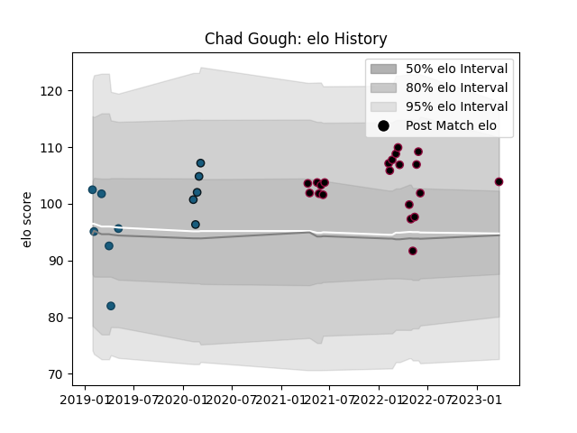

---  
layout: page  
title: Chad Gough  
date: 2023-03-29 11:31:27.204709  
categories: player  
---
# Chad Gough

Last updated: 2023-03-29
## Positions: H

## Current elo: 104.0

## Current Percentile: 72.0

# Elo History

# Match History

| Team             |   Appearances |   Win Rate |
|:-----------------|--------------:|-----------:|
| Utah Warriors    |            21 |   0.428571 |
| Glendale Raptors |             6 |   0.666667 |
| Colorado Raptors |             5 |   0.4      |

| Opponent               |   Matches |   Win Rate |
|:-----------------------|----------:|-----------:|
| Seattle Seawolves      |         5 |   0.2      |
| NOLA Gold              |         4 |   0.25     |
| San Diego Legion       |         4 |   0.25     |
| Toronto Arrows         |         4 |   0.75     |
| Austin Gilgronis       |         3 |   0.666667 |
| Houston SaberCats      |         3 |   0.333333 |
| L. A. Giltinis         |         3 |   0.333333 |
| Dallas Jackals         |         2 |   1        |
| Utah Warriors          |         2 |   1        |
| New England Free Jacks |         1 |   0        |
| Rugby ATL              |         1 |   1        |