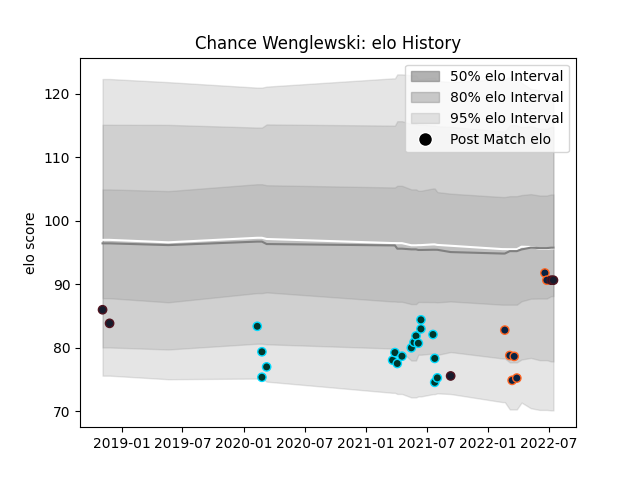

---  
layout: page  
title: Chance Wenglewski  
date: 2023-03-16 20:04:12.830034  
categories: player  
---
# Chance Wenglewski

## Positions: P

## Country: United States of America

## Current elo: 91.0

## Current Percentile: 33.0

# Elo History

# Match History

| Team                     |   Appearances |   Win Rate |
|:-------------------------|--------------:|-----------:|
| Rugby ATL                |            18 |   0.5      |
| R.U. New York            |            10 |   0.7      |
| Rugby New York           |             7 |   0.714286 |
| United States of America |             5 |   0.4      |

| Opponent               |   Matches |   Win Rate |
|:-----------------------|----------:|-----------:|
| New England Free Jacks |         6 |   0.5      |
| Toronto Arrows         |         4 |   0.5      |
| Seattle Seawolves      |         3 |   1        |
| San Diego Legion       |         3 |   1        |
| L. A. Giltinis         |         3 |   0.333333 |
| Rugby New York         |         3 |   0.333333 |
| R.U. New York          |         3 |   0.333333 |
| Rugby ATL              |         2 |   1        |
| Chile                  |         2 |   0.5      |
| NOLA Gold              |         2 |   1        |
| Old Glory DC           |         2 |   0        |
| Austin Elite Rugby     |         1 |   1        |
| New Zealand Maori      |         1 |   0        |
| Austin Gilgronis       |         1 |   0        |
| Ireland                |         1 |   0        |
| Houston SaberCats      |         1 |   1        |
| Canada                 |         1 |   1        |
| Utah Warriors          |         1 |   1        |