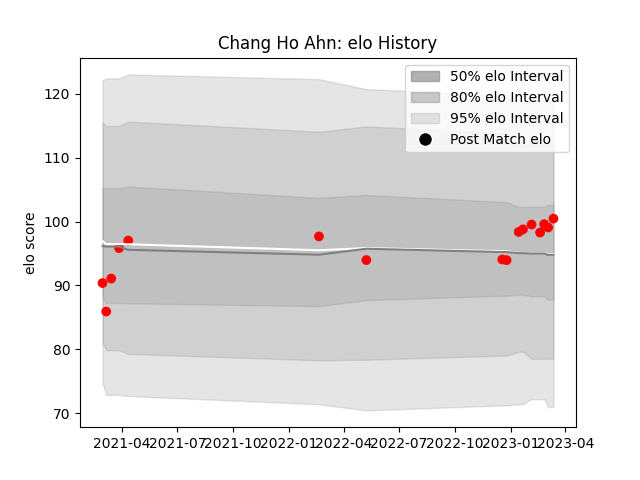

---  
layout: page  
title: Chang Ho Ahn  
date: 2023-03-21 18:04:07.659816  
categories: player  
---
# Chang Ho Ahn

Last updated: 2023-03-21
## Positions: P

## Current elo: 101.0

## Current Percentile: None

# Elo History

# Match History

| Team                  |   Appearances |   Win Rate |
|:----------------------|--------------:|-----------:|
| Yokohama Canon Eagles |            16 |       0.75 |

| Opponent                          |   Matches |   Win Rate |
|:----------------------------------|----------:|-----------:|
| Green Rockets Tokatsu             |         3 |   1        |
| Shizuoka Blue Revs                |         3 |   0.833333 |
| Black Rams Tokyo                  |         2 |   1        |
| Kubota Spears Funabashi Tokyo-Bay |         2 |   0.25     |
| Hanazono Kintetsu Liners          |         1 |   1        |
| Kobelco Kobe Steelers             |         1 |   0        |
| Mitsubishi Dynaboars              |         1 |   1        |
| Saitama Wild Knights              |         1 |   0        |
| Toshiba Brave Lupus Tokyo         |         1 |   1        |
| Toyota Verblitz                   |         1 |   1        |