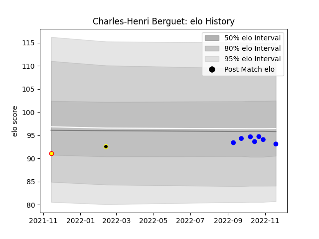

---  
layout: page  
title: Charles-Henri Berguet  
date: 2023-01-13 11:33:53.010616  
categories: player  
---
# Charles-Henri Berguet

## Positions: P

## Country: Belgium

## Current elo: 93.0

## Current Percentile: 44.0

# Elo History

# Match History

| Team           |   Appearances |   Win Rate |
|:---------------|--------------:|-----------:|
| Vannes         |            11 |   0.363636 |
| Mont-de-Marsan |             5 |   0.8      |
| Belgium        |             3 |   0        |

| Opponent       |   Matches |   Win Rate |
|:---------------|----------:|-----------:|
| Agen           |         3 |   0.333333 |
| Aurillac       |         2 |   0.5      |
| Massy          |         2 |   0.5      |
| Rouen          |         2 |   0.5      |
| Beziers        |         1 |   1        |
| Canada         |         1 |   0        |
| Colomiers      |         1 |   1        |
| Georgia        |         1 |   0        |
| Grenoble       |         1 |   1        |
| Hong Kong      |         1 |   0        |
| Mont-de-Marsan |         1 |   0        |
| Narbonne       |         1 |   1        |
| Oyonnax        |         1 |   0        |
| Vannes         |         1 |   0        |