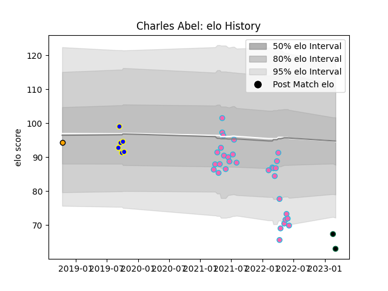

---  
layout: page  
title: Charles Abel  
date: 2023-03-16 19:48:46.442893  
categories: player  
---
# Charles Abel

## Positions: P

## Current elo: 60.0

## Current Percentile: 2.0

# Elo History

# Match History

| Team               |   Appearances |   Win Rate |
|:-------------------|--------------:|-----------:|
| L. A. Giltinis     |            31 |   0.709677 |
| Sydney Rays        |             6 |   0.166667 |
| Chicago Hounds     |             3 |   0        |
| NSW Country Eagles |             1 |   0        |

| Opponent               |   Matches |   Win Rate |
|:-----------------------|----------:|-----------:|
| Utah Warriors          |         5 |   0.4      |
| Austin Gilgronis       |         4 |   0.75     |
| Houston SaberCats      |         4 |   0.75     |
| San Diego Legion       |         4 |   0.75     |
| Seattle Seawolves      |         3 |   0.666667 |
| R.U. New York          |         2 |   0.5      |
| Toronto Arrows         |         2 |   0.5      |
| Rugby New York         |         2 |   0.5      |
| Rugby ATL              |         2 |   0.5      |
| Queensland Country     |         2 |   0.5      |
| Old Glory DC           |         2 |   0.5      |
| New England Free Jacks |         2 |   1        |
| Dallas Jackals         |         2 |   1        |
| Brisbane City          |         1 |   0        |
| Melbourne Rising       |         1 |   0        |
| Fijian Drua            |         1 |   0        |
| Canberra Vikings       |         1 |   0        |
| Western Force          |         1 |   0        |