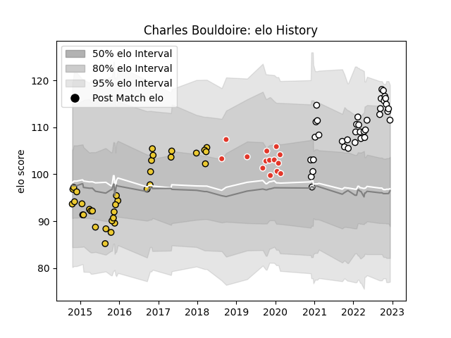

---  
layout: page  
title: Charles Bouldoire  
date: 2022-11-22 11:29:43.619994  
categories: player  
---
# Charles Bouldoire

## Positions: FB, C

## Current elo: 114.0

## Current Percentile: 91.0

# Elo History

# Match History

| Team                       |   Appearances |   Win Rate |
|:---------------------------|--------------:|-----------:|
| La Rochelle                |            35 |   0.457143 |
| Valence Romans Drome Rugby |            35 |   0.571429 |
| Biarritz Olympique         |            14 |   0.642857 |

| Opponent                   |   Matches |   Win Rate |
|:---------------------------|----------:|-----------:|
| Bayonne                    |         6 |   0.583333 |
| Montpellier Herault        |         4 |   0.5      |
| Soyaux-Angouleme           |         4 |   0.375    |
| Oyonnax                    |         3 |   0.333333 |
| Montauban                  |         3 |   0.666667 |
| Bordeaux Begles            |         3 |   0.666667 |
| Suresnes                   |         3 |   1        |
| Albi                       |         3 |   0.333333 |
| Dax                        |         3 |   0.333333 |
| Clermont Auvergne          |         3 |   0.333333 |
| Colomiers                  |         2 |   0        |
| Nice                       |         2 |   1        |
| Nevers                     |         2 |   0.5      |
| Perpignan                  |         2 |   0        |
| Rouen                      |         2 |   1        |
| Connacht                   |         2 |   0        |
| Cognac Saint Jean d'Angély |         2 |   1        |
| Pau                        |         2 |   0.5      |
| Stade Toulousain           |         2 |   0.5      |
| Blagnac                    |         2 |   0.5      |
| Tarbes                     |         2 |   0.5      |
| Scarlets                   |         1 |   0        |
| Roval Drome XV             |         1 |   1        |
| Stade Francais Paris       |         1 |   0.5      |
| Rennes                     |         1 |   1        |
| Racing 92                  |         1 |   0        |
| Provence Rugby             |         1 |   0        |
| Toulon                     |         1 |   1        |
| Vannes                     |         1 |   1        |
| Worcester Warriors         |         1 |   0        |
| Agen                       |         1 |   1        |
| Mont-de-Marsan             |         1 |   1        |
| Narbonne                   |         1 |   1        |
| Massy                      |         1 |   0        |
| Lyon                       |         1 |   1        |
| Grenoble                   |         1 |   1        |
| Gloucester Rugby           |         1 |   0        |
| Dijon                      |         1 |   1        |
| Chambery                   |         1 |   1        |
| Carqueiranne-Hyères        |         1 |   1        |
| Carcassonne                |         1 |   1        |
| Brive                      |         1 |   0        |
| Bourgoin-Jallieu           |         1 |   0.5      |
| Biarritz Olympique         |         1 |   1        |
| Beziers                    |         1 |   0        |
| Benetton Treviso           |         1 |   1        |
| Aurillac                   |         1 |   0        |
| Zebre                      |         1 |   0        |