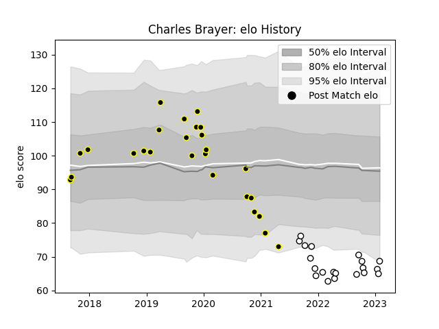

---  
layout: page  
title: Charles Brayer  
date: 2023-01-15 11:46:40.297106  
categories: player  
---
# Charles Brayer

## Positions: FL, N8

## Current elo: 66.0

## Current Percentile: 4.0

# Elo History

# Match History

| Team                       |   Appearances |   Win Rate |
|:---------------------------|--------------:|-----------:|
| Mont-de-Marsan             |            26 |   0.269231 |
| Valence Romans Drome Rugby |            18 |   0.583333 |

| Opponent                   |   Matches |   Win Rate |
|:---------------------------|----------:|-----------:|
| Vannes                     |         3 |   0.333333 |
| Nice                       |         3 |   1        |
| Carcassonne                |         3 |   0.333333 |
| Nevers                     |         3 |   0        |
| Beziers                    |         3 |   0.666667 |
| Grenoble                   |         2 |   0        |
| Provence Rugby             |         2 |   0.5      |
| Perpignan                  |         2 |   0        |
| Massy                      |         2 |   0.5      |
| Aurillac                   |         2 |   0.5      |
| Dijon                      |         2 |   0.5      |
| Colomiers                  |         2 |   0        |
| Cognac Saint Jean d'Angély |         2 |   1        |
| Bourgoin-Jallieu           |         2 |   0.25     |
| Blagnac                    |         2 |   0        |
| Chambery                   |         1 |   1        |
| Brive                      |         1 |   0        |
| Oyonnax                    |         1 |   0        |
| Rennes                     |         1 |   1        |
| Roval Drome XV             |         1 |   0        |
| Soyaux-Angouleme           |         1 |   0        |
| Suresnes                   |         1 |   1        |
| Tarbes                     |         1 |   0        |
| Narbonne                   |         1 |   1        |