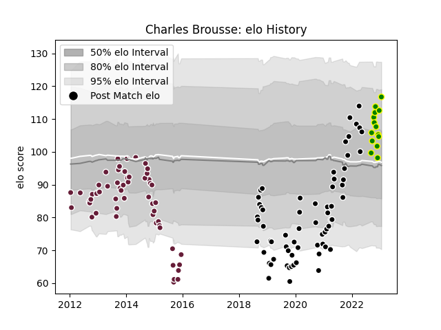

---  
layout: page  
title: Charles Brousse  
date: 2022-11-16 11:21:31.203693  
categories: player  
---
# Charles Brousse

## Positions: C

## Current elo: 118.0

## Current Percentile: 94.0

# Elo History

# Match History

| Team                |   Appearances |   Win Rate |
|:--------------------|--------------:|-----------:|
| Provence Rugby      |            59 |   0.550847 |
| Bordeaux Begles     |            48 |   0.333333 |
| Carqueiranne-Hyères |             8 |   0.5      |

| Opponent                   |   Matches |   Win Rate |
|:---------------------------|----------:|-----------:|
| Mont-de-Marsan             |         8 |   0.375    |
| Oyonnax                    |         7 |   0.285714 |
| Grenoble                   |         6 |   0.5      |
| Vannes                     |         5 |   0.6      |
| Carcassonne                |         5 |   0.6      |
| Nevers                     |         4 |   0.5      |
| Colomiers                  |         4 |   0.25     |
| Beziers                    |         4 |   0.75     |
| Biarritz Olympique         |         4 |   0.5      |
| Rouen                      |         4 |   0.375    |
| Brive                      |         4 |   0.25     |
| Clermont Auvergne          |         4 |   0.375    |
| Montauban                  |         3 |   1        |
| Aurillac                   |         3 |   0.666667 |
| Toulon                     |         3 |   0.333333 |
| Castres Olympique          |         3 |   0.833333 |
| London Welsh               |         2 |   1        |
| Soyaux-Angouleme           |         2 |   0        |
| Stade Toulousain           |         2 |   0.5      |
| Perpignan                  |         2 |   1        |
| Massy                      |         2 |   0.5      |
| Lyon                       |         2 |   0.5      |
| Roval Drome XV             |         2 |   1        |
| London Irish               |         2 |   0        |
| Gloucester Rugby           |         2 |   0        |
| Edinburgh                  |         2 |   0        |
| Dragons                    |         2 |   0.5      |
| US Bressane                |         2 |   0.5      |
| Bayonne                    |         2 |   0        |
| Bath Rugby                 |         2 |   0        |
| Suresnes                   |         1 |   0        |
| Stade Francais Paris       |         1 |   0        |
| Valence Romans Drome Rugby |         1 |   1        |
| Tarbes                     |         1 |   1        |
| Albi                       |         1 |   1        |
| Racing 92                  |         1 |   0        |
| Ospreys                    |         1 |   0        |
| Montpellier Herault        |         1 |   0        |
| Mogliano                   |         1 |   1        |
| La Rochelle                |         1 |   1        |
| Exeter Chiefs              |         1 |   0        |
| Cognac Saint Jean d'Angély |         1 |   1        |
| Chambery                   |         1 |   1        |
| Bourgoin-Jallieu           |         1 |   0        |
| Blagnac                    |         1 |   0        |
| Wasps                      |         1 |   0        |