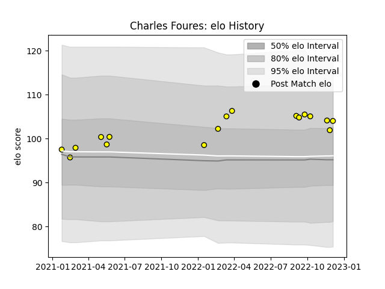

---  
layout: page  
title: Charles Foures  
date: 2022-12-18 16:24:20.806005  
categories: player  
---
# Charles Foures

## Positions: L

## Current elo: 107.0

## Current Percentile: 79.0

# Elo History

# Match History

| Team   |   Appearances |   Win Rate |
|:-------|--------------:|-----------:|
| Albi   |            18 |   0.638889 |

| Opponent                   |   Matches |   Win Rate |
|:---------------------------|----------:|-----------:|
| Blagnac                    |         2 |        0.5 |
| Bourgoin-Jallieu           |         2 |        0.5 |
| Cognac Saint Jean d'Angély |         2 |        1   |
| Dax                        |         2 |        1   |
| Massy                      |         2 |        0   |
| Tarbes                     |         2 |        0   |
| Chambery                   |         1 |        1   |
| Narbonne                   |         1 |        1   |
| Nice                       |         1 |        0.5 |
| Rennes                     |         1 |        1   |
| US Bressane                |         1 |        1   |
| Valence Romans Drome Rugby |         1 |        1   |