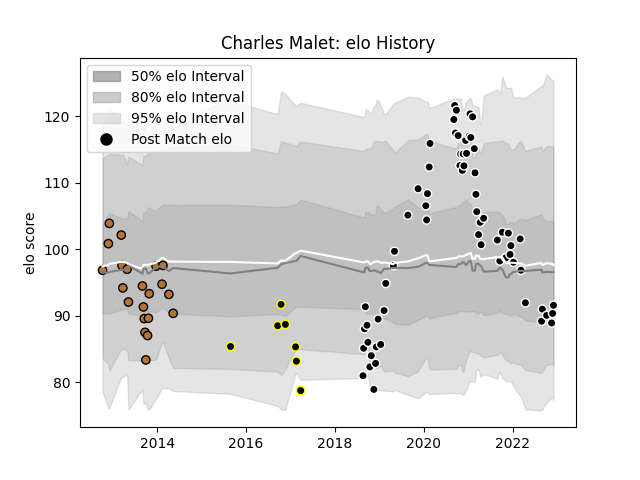

---  
layout: page  
title: Charles Malet  
date: 2022-12-09 13:15:43.720610  
categories: player  
---
# Charles Malet

## Positions: N8

## Current elo: 92.0

## Current Percentile: 28.0

# Elo History

# Match History

| Team           |   Appearances |   Win Rate |
|:---------------|--------------:|-----------:|
| Provence Rugby |            65 |   0.453846 |
| Narbonne       |            21 |   0.452381 |
| Mont-de-Marsan |             7 |   0.428571 |

| Opponent                   |   Matches |   Win Rate |
|:---------------------------|----------:|-----------:|
| Carcassonne                |         9 |  0.555556  |
| Mont-de-Marsan             |         8 |  0.5       |
| Montauban                  |         7 |  0.571429  |
| Oyonnax                    |         6 |  0.0833333 |
| Beziers                    |         5 |  0.6       |
| Colomiers                  |         5 |  0.4       |
| Agen                       |         4 |  0.25      |
| Soyaux-Angouleme           |         4 |  0.5       |
| Nevers                     |         4 |  0.25      |
| Vannes                     |         4 |  0.5       |
| Aurillac                   |         4 |  0.75      |
| Bayonne                    |         3 |  0.666667  |
| Grenoble                   |         3 |  0.666667  |
| Biarritz Olympique         |         3 |  0.5       |
| Valence Romans Drome Rugby |         2 |  1         |
| US Bressane                |         2 |  0.5       |
| Rouen                      |         2 |  0.25      |
| Perpignan                  |         2 |  0         |
| Massy                      |         2 |  0         |
| Bourgoin-Jallieu           |         2 |  0.5       |
| Lyon                       |         2 |  0         |
| Narbonne                   |         1 |  0         |
| Dax                        |         1 |  1         |
| Pau                        |         1 |  0         |
| Provence Rugby             |         1 |  0         |
| Albi                       |         1 |  1         |
| Roval Drome XV             |         1 |  1         |
| Auch                       |         1 |  0.5       |
| Tarbes                     |         1 |  0         |
| La Rochelle                |         1 |  0         |
| Brive                      |         1 |  1         |