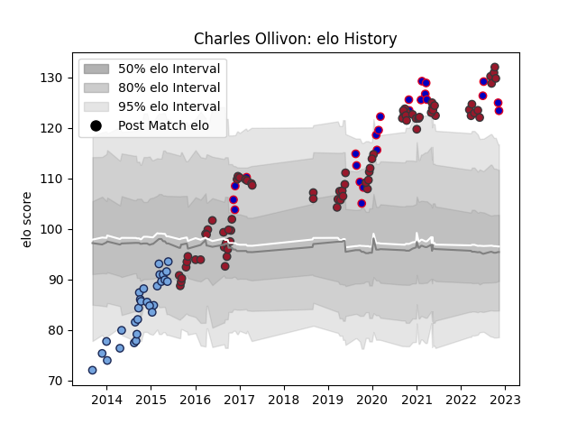

---  
layout: page  
title: Charles Ollivon  
date: 2023-03-21 18:09:05.568958  
categories: player  
---
# Charles Ollivon

Last updated: 2023-03-21
## Positions: FL, N8

## Country: France

## Current elo: 138.0

## Current Percentile: 99.0

# Elo History

# Match History

| Team    |   Appearances |   Win Rate |
|:--------|--------------:|-----------:|
| Toulon  |            87 |   0.597701 |
| Bayonne |            33 |   0.484848 |
| France  |            32 |   0.6875   |

| Opponent             |   Matches |   Win Rate |
|:---------------------|----------:|-----------:|
| Stade Toulousain     |        11 |   0.681818 |
| Racing 92            |        10 |   0.3      |
| Clermont Auvergne    |         9 |   0.555556 |
| Montpellier Herault  |         9 |   0.277778 |
| Lyon                 |         8 |   0.625    |
| Castres Olympique    |         8 |   0.5      |
| Bordeaux Begles      |         7 |   0.428571 |
| Pau                  |         7 |   0.857143 |
| La Rochelle          |         7 |   0.5      |
| Grenoble             |         7 |   0.5      |
| Stade Francais Paris |         6 |   0.833333 |
| Scotland             |         5 |   0.4      |
| Wales                |         5 |   0.8      |
| Brive                |         5 |   0.4      |
| Scarlets             |         5 |   0.8      |
| Ireland              |         4 |   0.5      |
| England              |         3 |   0.666667 |
| Italy                |         3 |   1        |
| Japan                |         3 |   1        |
| London Irish         |         3 |   1        |
| Bayonne              |         3 |   0.333333 |
| Oyonnax              |         2 |   1        |
| Saracens             |         2 |   0.5      |
| Agen                 |         2 |   1        |
| Argentina            |         2 |   0.5      |
| Bath Rugby           |         2 |   1        |
| Australia            |         2 |   0.5      |
| New Zealand          |         1 |   0        |
| Perpignan            |         1 |   0        |
| Fiji                 |         1 |   1        |
| Sale Sharks          |         1 |   1        |
| Samoa                |         1 |   1        |
| Bristol Rugby        |         1 |   0        |
| Biarritz Olympique   |         1 |   0        |
| Benetton Treviso     |         1 |   1        |
| South Africa         |         1 |   1        |
| Tonga                |         1 |   1        |
| Toulon               |         1 |   0        |
| Leicester Tigers     |         1 |   1        |