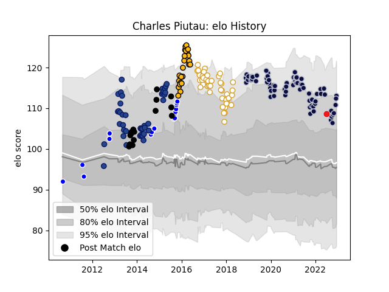

---  
layout: page  
title: Charles Piutau  
date: 2023-03-17 17:29:34.500041  
categories: player  
---
# Charles Piutau

## Positions: FB, W

## Country: Tonga

## Current elo: 120.0

## Current Percentile: 91.0

# Elo History

# Match History

| Team          |   Appearances |   Win Rate |
|:--------------|--------------:|-----------:|
| Bristol Rugby |            72 |   0.569444 |
| Ulster        |            42 |   0.666667 |
| Blues         |            41 |   0.365854 |
| Auckland      |            32 |   0.640625 |
| Wasps         |            23 |   0.608696 |
| New Zealand   |            17 |   1        |
| Tonga         |             1 |   0        |

| Opponent                 |   Matches |   Win Rate |
|:-------------------------|----------:|-----------:|
| Exeter Chiefs            |        14 |   0.357143 |
| Bath Rugby               |        10 |   0.9      |
| Sale Sharks              |         9 |   0.277778 |
| Harlequins               |         9 |   0.555556 |
| Wasps                    |         8 |   0.375    |
| Canterbury               |         7 |   0        |
| Northampton Saints       |         7 |   0.571429 |
| Gloucester Rugby         |         7 |   0.571429 |
| Saracens                 |         7 |   0.285714 |
| Leinster                 |         6 |   0.5      |
| Chiefs                   |         6 |   0        |
| Leicester Tigers         |         6 |   0.583333 |
| London Irish             |         6 |   0.833333 |
| Highlanders              |         5 |   0.4      |
| Tasman                   |         4 |   0.625    |
| Hurricanes               |         4 |   0.5      |
| Worcester Warriors       |         4 |   1        |
| Zebre                    |         4 |   0.75     |
| Cheetahs                 |         4 |   0.5      |
| Brumbies                 |         4 |   0.5      |
| Dragons                  |         4 |   0.875    |
| Crusaders                |         4 |   0.5      |
| Taranaki                 |         3 |   0.666667 |
| Edinburgh                |         3 |   0.666667 |
| Cardiff Blues            |         3 |   0.5      |
| Newcastle Falcons        |         3 |   1        |
| New South Wales Waratahs |         3 |   0.333333 |
| Munster                  |         3 |   0.333333 |
| South Africa             |         3 |   1        |
| Australia                |         3 |   1        |
| Argentina                |         3 |   1        |
| Connacht                 |         3 |   1        |
| Wellington               |         3 |   1        |
| Queensland Reds          |         2 |   0.5      |
| Stormers                 |         2 |   0.5      |
| Bordeaux Begles          |         2 |   0        |
| Southern Kings           |         2 |   1        |
| Toulon                   |         2 |   0.5      |
| Waikato                  |         2 |   1        |
| Benetton Treviso         |         2 |   1        |
| Scarlets                 |         2 |   1        |
| Western Force            |         2 |   1        |
| Bay of Plenty            |         2 |   0.5      |
| Bulls                    |         2 |   0        |
| Ospreys                  |         2 |   1        |
| Clermont Auvergne        |         2 |   0.5      |
| Northland                |         2 |   1        |
| France                   |         2 |   1        |
| Glasgow Warriors         |         2 |   1        |
| Hawke's Bay              |         2 |   0.5      |
| Manawatu                 |         2 |   1        |
| Counties Manukau         |         2 |   1        |
| Lions                    |         2 |   0        |
| Otago                    |         2 |   1        |
| La Rochelle              |         2 |   0.5      |
| United States of America |         1 |   1        |
| Fiji                     |         1 |   0        |
| Wales                    |         1 |   1        |
| Perpignan                |         1 |   1        |
| Japan                    |         1 |   1        |
| Stade Francais Paris     |         1 |   1        |
| Melbourne Rebels         |         1 |   1        |
| Sharks                   |         1 |   0        |
| Scotland                 |         1 |   1        |
| North Harbour            |         1 |   1        |
| Samoa                    |         1 |   1        |
| England                  |         1 |   1        |