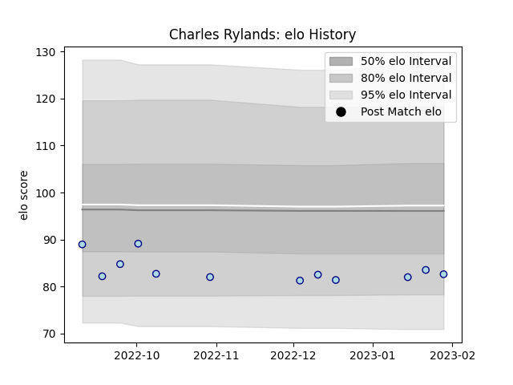

---  
layout: page  
title: Charles Rylands  
date: 2023-03-17 17:18:03.270997  
categories: player  
---
# Charles Rylands

## Positions: FL

## Current elo: 87.0

## Current Percentile: 32.0

# Elo History

# Match History

| Team    |   Appearances |   Win Rate |
|:--------|--------------:|-----------:|
| Bedford |            12 |   0.583333 |

| Opponent            |   Matches |   Win Rate |
|:--------------------|----------:|-----------:|
| Caldy               |         2 |        0.5 |
| Cornish Pirates     |         2 |        1   |
| London Scottish     |         2 |        1   |
| Coventry            |         1 |        0   |
| Doncaster           |         1 |        0   |
| Ealing Trailfinders |         1 |        0   |
| Hartpury College    |         1 |        1   |
| Nottingham          |         1 |        1   |
| Richmond            |         1 |        0   |