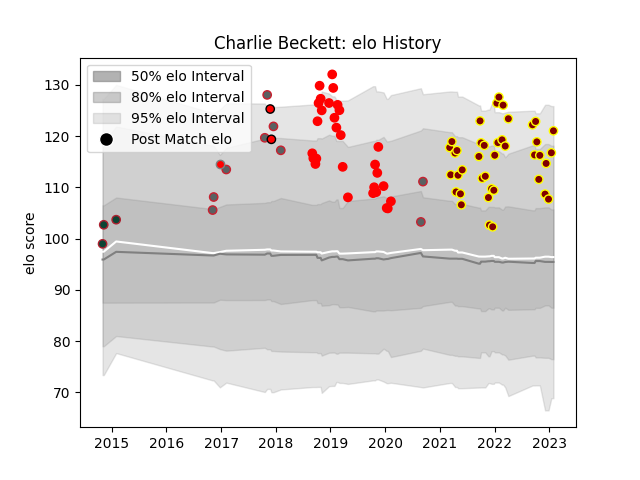

---  
layout: page  
title: Charlie Beckett  
date: 2023-03-21 18:19:16.281348  
categories: player  
---
# Charlie Beckett

Last updated: 2023-03-21
## Positions: L

## Current elo: 110.0

## Current Percentile: 72.0

# Elo History

# Match History

| Team             |   Appearances |   Win Rate |
|:-----------------|--------------:|-----------:|
| Ampthill         |            37 |   0.418919 |
| Jersey           |            29 |   0.551724 |
| Gloucester Rugby |             9 |   0.444444 |
| Leicester Tigers |             3 |   1        |
| Hartpury College |             2 |   0        |
| London Welsh     |             1 |   1        |

| Opponent            |   Matches |   Win Rate |
|:--------------------|----------:|-----------:|
| Cornish Pirates     |         7 |   0.5      |
| Coventry            |         7 |   0.285714 |
| Doncaster           |         7 |   0.428571 |
| Hartpury College    |         7 |   0.571429 |
| London Scottish     |         7 |   0.571429 |
| Bedford             |         6 |   0.333333 |
| Ealing Trailfinders |         6 |   0        |
| Richmond            |         5 |   0.9      |
| Nottingham          |         5 |   0.8      |
| Jersey              |         4 |   0.125    |
| Saracens            |         3 |   0.333333 |
| London Irish        |         3 |   0.666667 |
| Northampton Saints  |         2 |   0.5      |
| Yorkshire Carnegie  |         2 |   1        |
| Newcastle Falcons   |         2 |   0        |
| Sale Sharks         |         1 |   1        |
| Agen                |         1 |   1        |
| Leicester Tigers    |         1 |   0        |
| Ampthill            |         1 |   1        |
| Exeter Chiefs       |         1 |   0        |
| Dragons             |         1 |   1        |
| Caldy               |         1 |   1        |
| Zebre               |         1 |   1        |