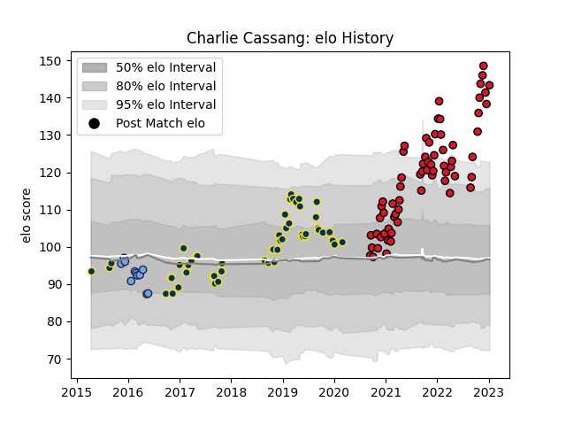

---  
layout: page  
title: Charlie Cassang  
date: 2023-01-13 11:36:53.295914  
categories: player  
---
# Charlie Cassang

## Positions: SH

## Current elo: 143.0

## Current Percentile: 99.0

# Elo History

# Match History

| Team              |   Appearances |   Win Rate |
|:------------------|--------------:|-----------:|
| Oyonnax           |            66 |   0.734848 |
| Clermont Auvergne |            52 |   0.586538 |
| Bayonne           |            11 |   0.590909 |

| Opponent                   |   Matches |   Win Rate |
|:---------------------------|----------:|-----------:|
| Beziers                    |         7 |   0.785714 |
| Grenoble                   |         7 |   0.642857 |
| Colomiers                  |         7 |   0.428571 |
| Agen                       |         6 |   1        |
| Carcassonne                |         6 |   1        |
| Montauban                  |         6 |   0.666667 |
| Lyon                       |         6 |   0.5      |
| Mont-de-Marsan             |         5 |   0.7      |
| Vannes                     |         5 |   0.8      |
| Bordeaux Begles            |         5 |   0.3      |
| Castres Olympique          |         4 |   0.25     |
| Nevers                     |         4 |   0.75     |
| Provence Rugby             |         4 |   0.75     |
| Perpignan                  |         4 |   0.5      |
| La Rochelle                |         4 |   0.75     |
| Toulon                     |         4 |   0.25     |
| Bayonne                    |         4 |   0.75     |
| Rouen                      |         4 |   0.75     |
| Stade Francais Paris       |         3 |   1        |
| Aurillac                   |         3 |   0.666667 |
| Biarritz Olympique         |         3 |   0.333333 |
| Racing 92                  |         3 |   0.166667 |
| Timisoara Saracens         |         2 |   1        |
| Stade Toulousain           |         2 |   0        |
| Soyaux-Angouleme           |         2 |   1        |
| US Bressane                |         2 |   1        |
| Valence Romans Drome Rugby |         2 |   1        |
| Pau                        |         2 |   0.5      |
| Brive                      |         2 |   0.5      |
| Oyonnax                    |         2 |   0.5      |
| Narbonne                   |         2 |   1        |
| Dragons                    |         2 |   1        |
| Northampton Saints         |         1 |   1        |
| Tarbes                     |         1 |   1        |
| Massy                      |         1 |   1        |
| Bourgoin-Jallieu           |         1 |   1        |
| Montpellier Herault        |         1 |   0        |