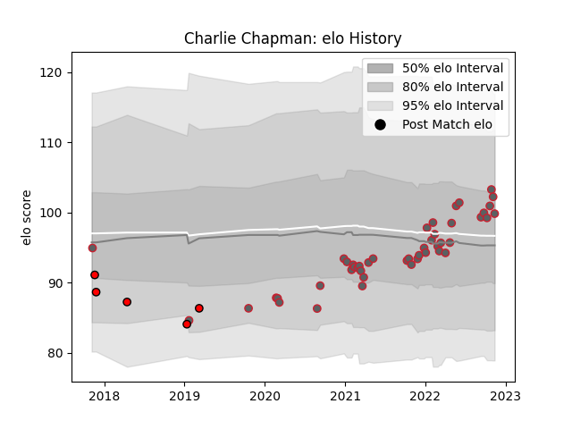

---  
layout: page  
title: Charlie Chapman  
date: 2022-12-14 11:36:03.977645  
categories: player  
---
# Charlie Chapman

## Positions: SH

## Current elo: 100.0

## Current Percentile: 70.0

# Elo History

# Match History

| Team             |   Appearances |   Win Rate |
|:-----------------|--------------:|-----------:|
| Gloucester Rugby |            49 |   0.438776 |
| Hartpury College |             5 |   0.2      |

| Opponent            |   Matches |   Win Rate |
|:--------------------|----------:|-----------:|
| Sale Sharks         |         6 |   0.333333 |
| Exeter Chiefs       |         6 |   0.333333 |
| London Irish        |         5 |   0.5      |
| Wasps               |         5 |   0.6      |
| Saracens            |         4 |   0.5      |
| Northampton Saints  |         4 |   0.75     |
| Harlequins          |         4 |   0        |
| Newcastle Falcons   |         3 |   0.333333 |
| Bath Rugby          |         3 |   1        |
| Leicester Tigers    |         3 |   0        |
| Bristol Rugby       |         3 |   0.333333 |
| Bedford             |         1 |   0        |
| London Scottish     |         1 |   0        |
| Ealing Trailfinders |         1 |   0        |
| Nottingham          |         1 |   1        |
| Richmond            |         1 |   0        |
| Castres Olympique   |         1 |   0        |
| Bordeaux Begles     |         1 |   1        |
| Worcester Warriors  |         1 |   1        |