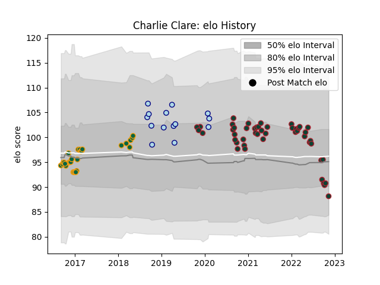

---  
layout: page  
title: Charlie Clare  
date: 2023-03-21 18:20:11.532299  
categories: player  
---
# Charlie Clare

Last updated: 2023-03-21
## Positions: H

## Current elo: 70.0

## Current Percentile: 3.0

# Elo History

# Match History

| Team               |   Appearances |   Win Rate |
|:-------------------|--------------:|-----------:|
| Leicester Tigers   |            68 |   0.595588 |
| Northampton Saints |            28 |   0.5      |
| Bedford            |            19 |   0.526316 |

| Opponent            |   Matches |   Win Rate |
|:--------------------|----------:|-----------:|
| Bath Rugby          |         9 |   0.333333 |
| London Irish        |         9 |   0.555556 |
| Newcastle Falcons   |         9 |   0.666667 |
| Sale Sharks         |         7 |   0.428571 |
| Gloucester Rugby    |         7 |   0.857143 |
| Saracens            |         7 |   0.285714 |
| Northampton Saints  |         6 |   0.666667 |
| Wasps               |         6 |   0.333333 |
| Worcester Warriors  |         5 |   1        |
| Harlequins          |         5 |   0.4      |
| Bristol Rugby       |         4 |   0.625    |
| Exeter Chiefs       |         4 |   0.25     |
| Jersey              |         3 |   0.666667 |
| Coventry            |         3 |   0.666667 |
| Montpellier Herault |         3 |   0.333333 |
| Leicester Tigers    |         3 |   0.333333 |
| Ospreys             |         2 |   0.5      |
| Nottingham          |         2 |   1        |
| Hartpury College    |         2 |   0.5      |
| Ealing Trailfinders |         2 |   0        |
| Connacht            |         2 |   1        |
| Clermont Auvergne   |         2 |   1        |
| Bayonne             |         1 |   1        |
| Leinster            |         1 |   0        |
| London Scottish     |         1 |   0        |
| Doncaster           |         1 |   1        |
| Cornish Pirates     |         1 |   0        |
| Castres Olympique   |         1 |   1        |
| Richmond            |         1 |   1        |
| Cardiff Blues       |         1 |   1        |
| Calvisano           |         1 |   1        |
| Toulon              |         1 |   0        |
| Brive               |         1 |   1        |
| Bordeaux Begles     |         1 |   1        |
| Yorkshire Carnegie  |         1 |   1        |