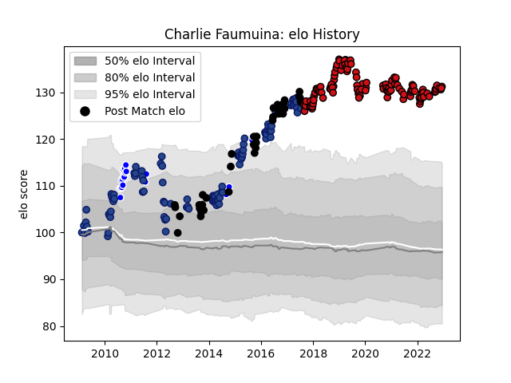

---  
layout: page  
title: Charlie Faumuina  
date: 2022-12-14 11:18:47.836107  
categories: player  
---
# Charlie Faumuina

## Positions: P

## Country: New Zealand

## Current elo: 131.0

## Current Percentile: 99.0

# Elo History

# Match History

| Team             |   Appearances |   Win Rate |
|:-----------------|--------------:|-----------:|
| Stade Toulousain |           112 |   0.6875   |
| Blues            |            99 |   0.449495 |
| New Zealand      |            38 |   0.894737 |
| Auckland         |            21 |   0.714286 |

| Opponent                 |   Matches |   Win Rate |
|:-------------------------|----------:|-----------:|
| Chiefs                   |        10 |   0.15     |
| Castres Olympique        |        10 |   0.35     |
| Racing 92                |        10 |   0.7      |
| Hurricanes               |        10 |   0.2      |
| Pau                      |        10 |   0.7      |
| Crusaders                |        10 |   0.3      |
| Lyon                     |         9 |   0.388889 |
| Highlanders              |         9 |   0.555556 |
| Stade Francais Paris     |         9 |   0.5      |
| La Rochelle              |         8 |   0.875    |
| New South Wales Waratahs |         8 |   0.5      |
| Australia                |         8 |   0.9375   |
| Montpellier Herault      |         7 |   0.571429 |
| Brive                    |         7 |   0.857143 |
| South Africa             |         7 |   0.857143 |
| Lions                    |         7 |   0.571429 |
| Queensland Reds          |         6 |   0.416667 |
| Western Force            |         6 |   0.916667 |
| Clermont Auvergne        |         6 |   0.833333 |
| Brumbies                 |         6 |   0.666667 |
| Bordeaux Begles          |         6 |   0.833333 |
| Bulls                    |         6 |   0.666667 |
| Sharks                   |         5 |   0.2      |
| Argentina                |         5 |   1        |
| Cheetahs                 |         5 |   0.6      |
| Agen                     |         4 |   1        |
| Stormers                 |         4 |   0        |
| British and Irish Lions  |         4 |   0.625    |
| Perpignan                |         4 |   0.75     |
| Melbourne Rebels         |         3 |   0.666667 |
| Leinster                 |         3 |   0.333333 |
| Ireland                  |         3 |   0.666667 |
| Toulon                   |         3 |   1        |
| Waikato                  |         3 |   0.333333 |
| Wales                    |         3 |   1        |
| Southland                |         2 |   0.5      |
| Bath Rugby               |         2 |   1        |
| Tasman                   |         2 |   0.75     |
| Wellington               |         2 |   1        |
| Oyonnax                  |         2 |   0.75     |
| North Harbour            |         2 |   1        |
| Connacht                 |         2 |   1        |
| Italy                    |         2 |   1        |
| Canterbury               |         2 |   0        |
| France                   |         2 |   1        |
| Gloucester Rugby         |         2 |   1        |
| Grenoble                 |         2 |   1        |
| Northland                |         2 |   1        |
| Biarritz Olympique       |         1 |   1        |
| Bayonne                  |         1 |   1        |
| Exeter Chiefs            |         1 |   0        |
| Otago                    |         1 |   1        |
| Georgia                  |         1 |   1        |
| United States of America |         1 |   1        |
| Ulster                   |         1 |   1        |
| Munster                  |         1 |   1        |
| Manawatu                 |         1 |   1        |
| Taranaki                 |         1 |   1        |
| Sunwolves                |         1 |   0        |
| Hawke's Bay              |         1 |   0.5      |
| Cardiff Blues            |         1 |   0        |
| Counties Manukau         |         1 |   1        |
| Southern Kings           |         1 |   1        |
| Bay of Plenty            |         1 |   1        |
| Jaguares                 |         1 |   1        |
| Scotland                 |         1 |   1        |
| Samoa                    |         1 |   1        |
| Namibia                  |         1 |   1        |