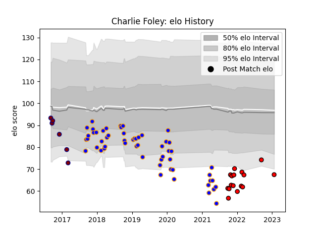

---  
layout: page  
title: Charlie Foley  
date: 2023-01-23 15:31:04.230055  
categories: player  
---
# Charlie Foley

## Positions: C, FH

## Current elo: 67.0

## Current Percentile: 7.0

# Elo History

# Match History

| Team             |   Appearances |   Win Rate |
|:-----------------|--------------:|-----------:|
| Doncaster        |            55 |   0.445455 |
| Hartpury College |            16 |   0.4375   |
| Rotherham Titans |             6 |   0.333333 |

| Opponent            |   Matches |   Win Rate |
|:--------------------|----------:|-----------:|
| Jersey              |         9 |   0.333333 |
| Bedford             |         9 |   0.388889 |
| Nottingham          |         7 |   0.571429 |
| Ealing Trailfinders |         7 |   0.142857 |
| Richmond            |         6 |   0.5      |
| Cornish Pirates     |         6 |   0.333333 |
| Coventry            |         6 |   0.5      |
| London Scottish     |         5 |   0.8      |
| Ampthill            |         4 |   0.5      |
| Yorkshire Carnegie  |         4 |   0.25     |
| Hartpury College    |         3 |   1        |
| London Irish        |         2 |   0        |
| Doncaster           |         2 |   0        |
| Rotherham Titans    |         2 |   1        |
| London Welsh        |         1 |   1        |
| Newcastle Falcons   |         1 |   0        |
| Caldy               |         1 |   1        |
| Bristol Rugby       |         1 |   0        |
| Saracens            |         1 |   0        |