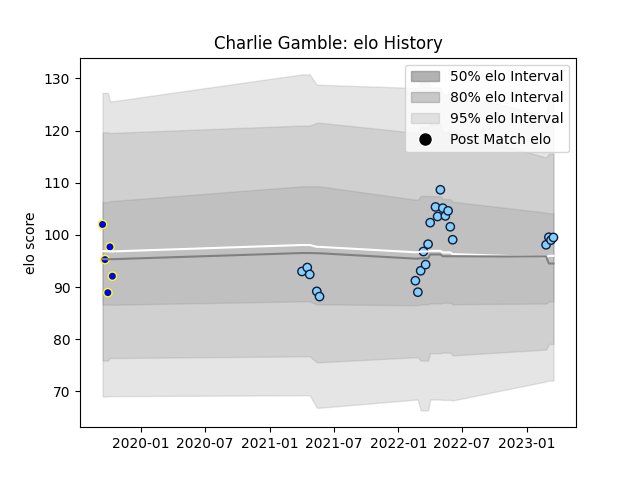

---  
layout: page  
title: Charlie Gamble  
date: 2023-02-24 09:53:34.757778  
categories: player  
---
# Charlie Gamble

## Positions: FL

## Current elo: 99.0

## Current Percentile: 64.0

# Elo History

# Match History

| Team                     |   Appearances |   Win Rate |
|:-------------------------|--------------:|-----------:|
| New South Wales Waratahs |            20 |        0.4 |
| Sydney Rays              |             5 |        0.2 |

| Opponent           |   Matches |   Win Rate |
|:-------------------|----------:|-----------:|
| Western Force      |         4 |   0.5      |
| Fijian Drua        |         3 |   0.666667 |
| Blues              |         2 |   0        |
| Brumbies           |         2 |   0        |
| Chiefs             |         2 |   0        |
| Hurricanes         |         2 |   0        |
| Melbourne Rebels   |         2 |   0.5      |
| Queensland Reds    |         2 |   0        |
| Canberra Vikings   |         1 |   0        |
| Crusaders          |         1 |   1        |
| Highlanders        |         1 |   1        |
| Melbourne Rising   |         1 |   0        |
| Moana Pasifika     |         1 |   1        |
| Queensland Country |         1 |   1        |