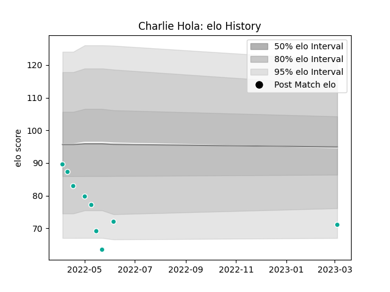

---  
layout: page  
title: Charlie Hola  
date: 2023-03-09 10:12:54.601691  
categories: player  
---
# Charlie Hola

## Positions: L

## Current elo: 71.0

## Current Percentile: 6.0

# Elo History

# Match History

| Team           |   Appearances |   Win Rate |
|:---------------|--------------:|-----------:|
| Dallas Jackals |             9 |          0 |

| Opponent          |   Matches |   Win Rate |
|:------------------|----------:|-----------:|
| L. A. Giltinis    |         2 |          0 |
| Seattle Seawolves |         2 |          0 |
| Austin Gilgronis  |         1 |          0 |
| Houston SaberCats |         1 |          0 |
| San Diego Legion  |         1 |          0 |
| Toronto Arrows    |         1 |          0 |
| Utah Warriors     |         1 |          0 |