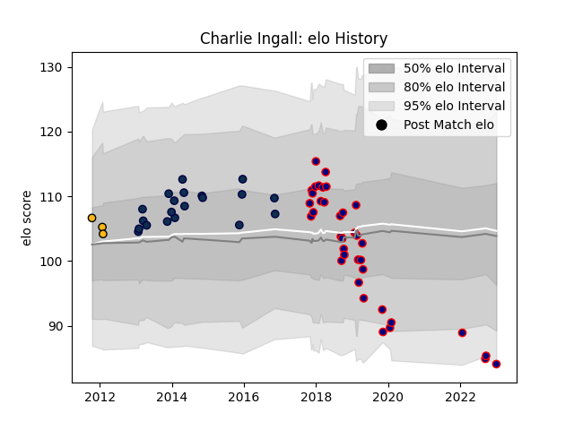

---  
layout: page  
title: Charlie Ingall  
date: 2023-01-06 00:25:04.142098  
categories: player  
---
# Charlie Ingall

## Positions: W, FB

## Current elo: 84.0

## Current Percentile: 5.0

# Elo History

# Match History

| Team            |   Appearances |   Win Rate |
|:----------------|--------------:|-----------:|
| London Scottish |            37 |   0.337838 |
| Sale Sharks     |            20 |   0.5      |
| Wasps           |             3 |   0        |

| Opponent            |   Matches |   Win Rate |
|:--------------------|----------:|-----------:|
| Richmond            |         6 |   0.166667 |
| Bedford             |         4 |   0.375    |
| Hartpury College    |         4 |   0        |
| Nottingham          |         4 |   0.5      |
| Wasps               |         3 |   1        |
| London Irish        |         3 |   0        |
| Jersey              |         3 |   0.666667 |
| Leicester Tigers    |         3 |   0        |
| Coventry            |         3 |   0.333333 |
| Cornish Pirates     |         3 |   0.666667 |
| Exeter Chiefs       |         2 |   0.5      |
| Harlequins          |         2 |   0.5      |
| Ealing Trailfinders |         2 |   0        |
| Bristol Rugby       |         2 |   0        |
| Doncaster           |         2 |   0        |
| Northampton Saints  |         2 |   0        |
| Rotherham Titans    |         2 |   1        |
| Saracens            |         2 |   0.5      |
| Castres Olympique   |         2 |   1        |
| Worcester Warriors  |         2 |   0.5      |
| Dragons             |         1 |   0        |
| Ospreys             |         1 |   0        |
| Scarlets            |         1 |   1        |
| Yorkshire Carnegie  |         1 |   1        |