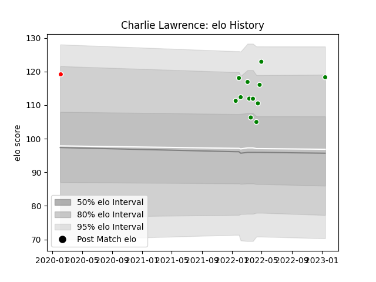

---  
layout: page  
title: Charlie Lawrence  
date: 2023-03-17 17:33:26.224330  
categories: player  
---
# Charlie Lawrence

## Positions: C

## Current elo: 116.0

## Current Percentile: 88.0

# Elo History

# Match History

| Team                  |   Appearances |   Win Rate |
|:----------------------|--------------:|-----------:|
| Toyota Verblitz       |            22 |   0.681818 |
| Kobelco Kobe Steelers |             1 |   1        |

| Opponent                          |   Matches |   Win Rate |
|:----------------------------------|----------:|-----------:|
| NTT Docomo Red Hurricanes Osaka   |         3 |        1   |
| Black Rams Tokyo                  |         2 |        1   |
| Green Rockets Tokatsu             |         2 |        1   |
| Saitama Wild Knights              |         2 |        0   |
| Tokyo Sungoliath                  |         2 |        0.5 |
| Toshiba Brave Lupus Tokyo         |         2 |        0.5 |
| Yokohama Canon Eagles             |         2 |        0   |
| Hanazono Kintetsu Liners          |         1 |        1   |
| Hino Red Dolphins                 |         1 |        1   |
| Kobelco Kobe Steelers             |         1 |        1   |
| Kubota Spears Funabashi Tokyo-Bay |         1 |        0   |
| Mitsubishi Dynaboars              |         1 |        1   |
| Munakata Sanix Blues              |         1 |        1   |
| Shizuoka Blue Revs                |         1 |        1   |
| Urayasu D-Rocks                   |         1 |        1   |