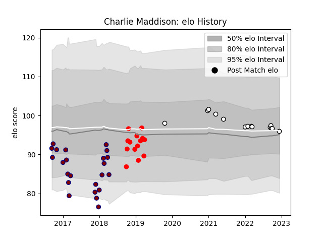

---  
layout: page  
title: Charlie Maddison  
date: 2023-01-13 11:28:25.534305  
categories: player  
---
# Charlie Maddison

## Positions: H, FL

## Current elo: 89.0

## Current Percentile: None

# Elo History

# Match History

| Team              |   Appearances |   Win Rate |
|:------------------|--------------:|-----------:|
| Rotherham Titans  |            30 |   0.166667 |
| Newcastle Falcons |            19 |   0.368421 |
| Jersey            |            18 |   0.666667 |

| Opponent            |   Matches |   Win Rate |
|:--------------------|----------:|-----------:|
| Bedford             |         7 |   0.285714 |
| Yorkshire Carnegie  |         6 |   0.5      |
| Richmond            |         5 |   0.8      |
| Cornish Pirates     |         5 |   0.8      |
| London Scottish     |         5 |   0        |
| Ealing Trailfinders |         4 |   0        |
| Bristol Rugby       |         4 |   0.25     |
| Hartpury College    |         4 |   0.5      |
| Doncaster           |         4 |   0.5      |
| Jersey              |         3 |   0        |
| Leicester Tigers    |         3 |   0.333333 |
| London Irish        |         2 |   0.5      |
| Harlequins          |         2 |   0        |
| Nottingham          |         2 |   0.5      |
| London Welsh        |         1 |   1        |
| Saracens            |         1 |   0        |
| Worcester Warriors  |         1 |   0        |
| Ampthill            |         1 |   1        |
| Bath Rugby          |         1 |   0        |
| Exeter Chiefs       |         1 |   0        |
| Coventry            |         1 |   0        |
| Connacht            |         1 |   0        |
| Castres Olympique   |         1 |   1        |
| Cardiff Blues       |         1 |   0        |
| Gloucester Rugby    |         1 |   0        |