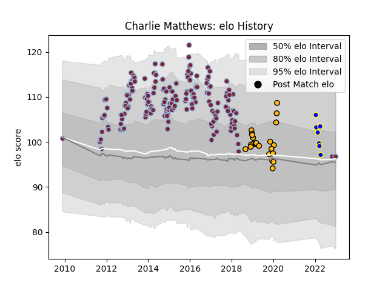

---  
layout: page  
title: Charlie Matthews  
date: 2022-12-28 12:52:44.192569  
categories: player  
---
# Charlie Matthews

## Positions: L

## Current elo: 97.0

## Current Percentile: 57.0

# Elo History

# Match History

| Team              |   Appearances |   Win Rate |
|:------------------|--------------:|-----------:|
| Harlequins        |           184 |   0.584239 |
| Wasps             |            23 |   0.26087  |
| Kamaishi Seawaves |             7 |   0        |

| Opponent                 |   Matches |   Win Rate |
|:-------------------------|----------:|-----------:|
| Leicester Tigers         |        16 |   0.4375   |
| Sale Sharks              |        16 |   0.625    |
| Exeter Chiefs            |        15 |   0.2      |
| Gloucester Rugby         |        14 |   0.75     |
| Bath Rugby               |        14 |   0.5      |
| Saracens                 |        14 |   0.214286 |
| London Irish             |        14 |   0.857143 |
| Wasps                    |        14 |   0.571429 |
| Northampton Saints       |        13 |   0.384615 |
| Worcester Warriors       |        12 |   0.75     |
| Newcastle Falcons        |        12 |   0.5      |
| London Welsh             |         5 |   1        |
| Stade Toulousain         |         4 |   0.25     |
| Edinburgh                |         3 |   0        |
| Cardiff Blues            |         3 |   0.666667 |
| Leinster                 |         3 |   0.333333 |
| Stade Francais Paris     |         2 |   0.5      |
| Scarlets                 |         2 |   1        |
| Montpellier Herault      |         2 |   0.5      |
| Timisoara Saracens       |         2 |   1        |
| Ulster                   |         2 |   0        |
| Racing 92                |         2 |   1        |
| Ospreys                  |         2 |   1        |
| Zebre                    |         2 |   1        |
| Mie Honda Heat           |         2 |   0        |
| La Rochelle              |         2 |   0        |
| Hino Red Dolphins        |         2 |   0        |
| Harlequins               |         2 |   0        |
| Hanazono Kintetsu Liners |         2 |   0        |
| Connacht                 |         2 |   1        |
| Castres Olympique        |         2 |   1        |
| Calvisano                |         2 |   1        |
| Bristol Rugby            |         2 |   0.5      |
| Biarritz Olympique       |         2 |   1        |
| Munster                  |         1 |   0        |
| Grenoble                 |         1 |   1        |
| Dragons                  |         1 |   1        |
| Skyactivs Hiroshima      |         1 |   0        |
| Clermont Auvergne        |         1 |   0        |
| Agen                     |         1 |   1        |