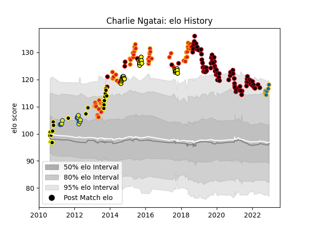

---  
layout: page  
title: Charlie Ngatai  
date: 2022-12-14 11:13:53.231065  
categories: player  
---
# Charlie Ngatai

## Positions: C, FB

## Country: New Zealand Maori

## Current elo: 118.0

## Current Percentile: 92.0

# Elo History

# Match History

| Team              |   Appearances |   Win Rate |
|:------------------|--------------:|-----------:|
| Lyon              |            78 |   0.564103 |
| Chiefs            |            54 |   0.685185 |
| Taranaki          |            26 |   0.634615 |
| Wellington        |            22 |   0.727273 |
| Hurricanes        |            15 |   0.533333 |
| Leinster          |             8 |   1        |
| New Zealand Maori |             7 |   0.857143 |

| Opponent                 |   Matches |   Win Rate |
|:-------------------------|----------:|-----------:|
| Crusaders                |        11 |   0.545455 |
| Hurricanes               |         9 |   0.444444 |
| Highlanders              |         8 |   0.625    |
| Canterbury               |         7 |   0.285714 |
| Pau                      |         7 |   0.642857 |
| Bordeaux Begles          |         7 |   0.428571 |
| Racing 92                |         7 |   0.714286 |
| Clermont Auvergne        |         7 |   0.428571 |
| La Rochelle              |         6 |   0.5      |
| Toulon                   |         6 |   0.666667 |
| Castres Olympique        |         6 |   0.166667 |
| Montpellier Herault      |         5 |   0.8      |
| Stade Francais Paris     |         5 |   0.8      |
| Brumbies                 |         5 |   0.8      |
| Stormers                 |         4 |   0.5      |
| Blues                    |         4 |   1        |
| Auckland                 |         4 |   0.75     |
| Bay of Plenty            |         4 |   0.75     |
| North Harbour            |         4 |   0.75     |
| Western Force            |         4 |   1        |
| Northland                |         4 |   1        |
| Perpignan                |         4 |   1        |
| Queensland Reds          |         4 |   1        |
| Brive                    |         4 |   0.5      |
| Sharks                   |         4 |   0.75     |
| Manawatu                 |         4 |   1        |
| Stade Toulousain         |         3 |   0.5      |
| Waikato                  |         3 |   1        |
| Otago                    |         3 |   0.666667 |
| Wellington               |         3 |   0.333333 |
| Lions                    |         3 |   0.666667 |
| Tasman                   |         3 |   0.333333 |
| Agen                     |         3 |   0.666667 |
| Cheetahs                 |         3 |   0.666667 |
| Hawke's Bay              |         3 |   0.333333 |
| Counties Manukau         |         3 |   0.833333 |
| Southern Kings           |         2 |   1        |
| Bulls                    |         2 |   0.5      |
| Cardiff Blues            |         2 |   0        |
| Southland                |         2 |   1        |
| Chiefs                   |         2 |   0.5      |
| Canada                   |         2 |   1        |
| Benetton Treviso         |         2 |   1        |
| Northampton Saints       |         2 |   0        |
| Jaguares                 |         2 |   0.5      |
| New South Wales Waratahs |         2 |   0.5      |
| Japan                    |         2 |   1        |
| Bayonne                  |         1 |   1        |
| United States of America |         1 |   1        |
| Ulster                   |         1 |   1        |
| British and Irish Lions  |         1 |   0        |
| Biarritz Olympique       |         1 |   1        |
| Leinster                 |         1 |   0        |
| Taranaki                 |         1 |   1        |
| Melbourne Rebels         |         1 |   0        |
| Scarlets                 |         1 |   1        |
| Connacht                 |         1 |   1        |
| Fiji                     |         1 |   1        |
| Glasgow Warriors         |         1 |   1        |
| Grenoble                 |         1 |   1        |
| Zebre                    |         1 |   1        |