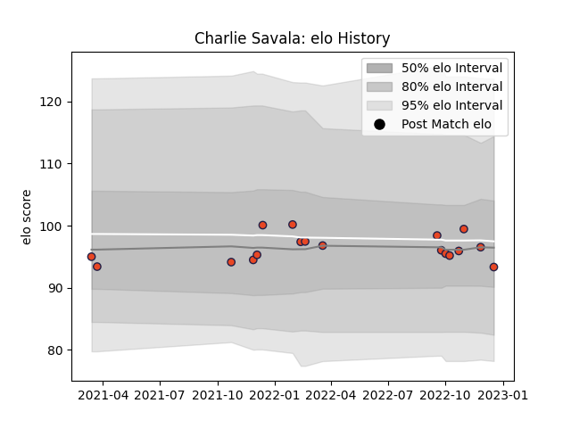

---  
layout: page  
title: Charlie Savala  
date: 2022-12-18 16:33:58.935502  
categories: player  
---
# Charlie Savala

## Positions: FH

## Current elo: 93.0

## Current Percentile: 51.0

# Elo History

# Match History

| Team      |   Appearances |   Win Rate |
|:----------|--------------:|-----------:|
| Edinburgh |            18 |        0.5 |

| Opponent          |   Matches |   Win Rate |
|:------------------|----------:|-----------:|
| Benetton Treviso  |         2 |        0.5 |
| Cardiff Blues     |         2 |        0.5 |
| Dragons           |         2 |        1   |
| Zebre             |         2 |        1   |
| Bulls             |         1 |        0   |
| Castres Olympique |         1 |        1   |
| Connacht          |         1 |        1   |
| Glasgow Warriors  |         1 |        0   |
| Leinster          |         1 |        0   |
| Lions             |         1 |        0   |
| Munster           |         1 |        0   |
| Ospreys           |         1 |        0   |
| Saracens          |         1 |        1   |
| Stormers          |         1 |        0   |