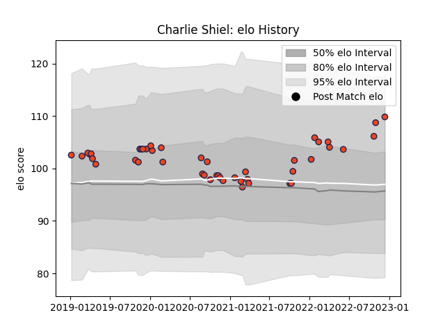

---  
layout: page  
title: Charlie Shiel  
date: 2023-01-06 00:25:26.146556  
categories: player  
---
# Charlie Shiel

## Positions: SH

## Current elo: 119.0

## Current Percentile: 88.0

# Elo History

# Match History

| Team      |   Appearances |   Win Rate |
|:----------|--------------:|-----------:|
| Edinburgh |            50 |       0.56 |

| Opponent         |   Matches |   Win Rate |
|:-----------------|----------:|-----------:|
| Cardiff Blues    |         7 |   0.714286 |
| Glasgow Warriors |         5 |   0.4      |
| Zebre            |         4 |   1        |
| Scarlets         |         4 |   0.75     |
| Ulster           |         3 |   0        |
| Leinster         |         3 |   0.333333 |
| Munster          |         3 |   0.333333 |
| Bordeaux Begles  |         3 |   0.166667 |
| Dragons          |         2 |   0.5      |
| Connacht         |         2 |   1        |
| Southern Kings   |         2 |   1        |
| Stormers         |         2 |   0.25     |
| Bulls            |         1 |   1        |
| Lions            |         1 |   0        |
| Benetton Treviso |         1 |   0        |
| Ospreys          |         1 |   0        |
| Pau              |         1 |   1        |
| Saracens         |         1 |   0        |
| Brive            |         1 |   1        |
| Sharks           |         1 |   1        |
| Wasps            |         1 |   1        |
| Agen             |         1 |   1        |